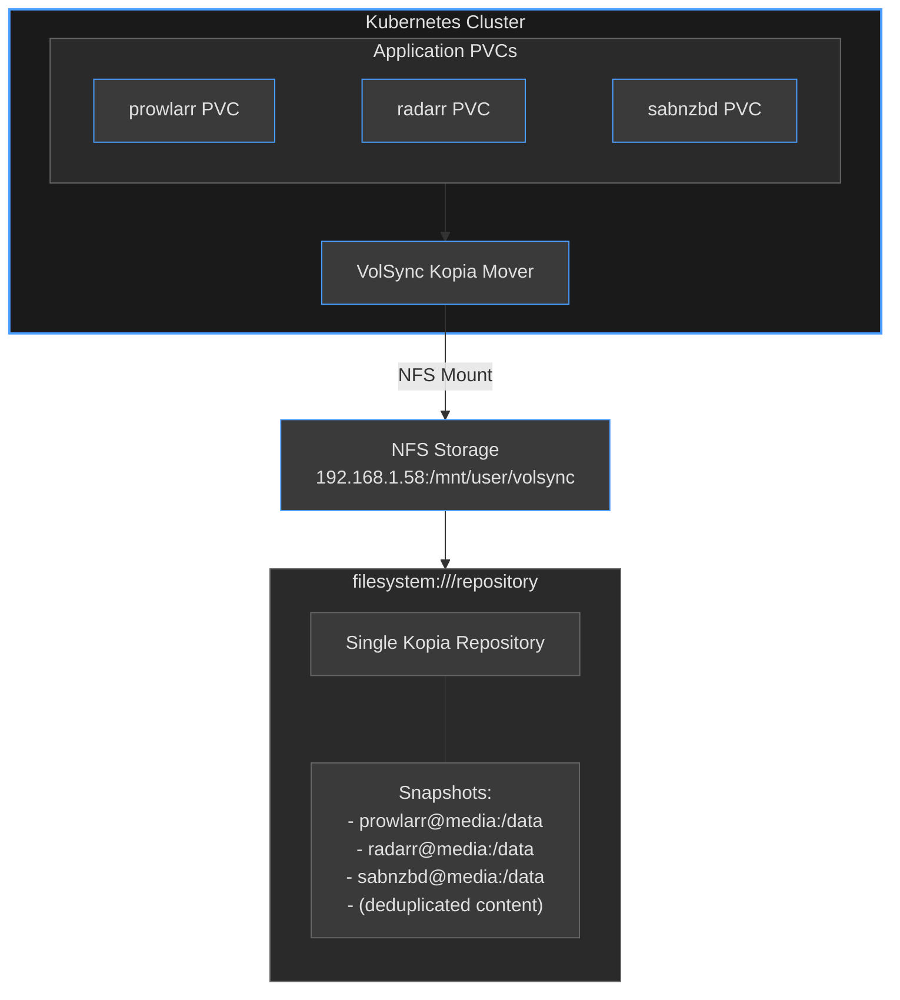

# Backup Strategy Architecture

## Overview

This document describes the backup strategy for the home-ops Kubernetes cluster, including the
architecture, implementation details, and critical learnings from deployment.

## Table of Contents

- [Architecture Overview](#architecture-overview)
- [VolSync with Kopia Backend](#volsync-with-kopia-backend)
- [Storage Backend (NFS)](#storage-backend-nfs)
- [Shared Repository Pattern](#shared-repository-pattern)
- [Configuration](#configuration)
- [Critical Learnings](#critical-learnings)
- [Troubleshooting](#troubleshooting)

## Architecture Overview

### Components

1. **VolSync** - Kubernetes operator for volume replication and backup
   - Fork: `perfectra1n/volsync` (adds Kopia support)
   - Chart: from home-operations/charts-mirror

2. **Kopia** - Content-addressable backup system
   - Backend: NFS filesystem (Nezuko server)
   - Repository mode: Shared multi-tenant
   - GUI Server: Web UI for repository management (kubernetes/apps/storage/kopia)

3. **NFS Storage** - Network filesystem backup destination
   - Server: `192.168.1.58` (Nezuko server)
   - Path: `/mnt/user/volsync`
   - Mount Point: `/repository` (auto-injected by MutatingAdmissionPolicy)

### Data Flow



## VolSync with Kopia Backend

### Why Kopia?

Kopia was chosen over other backup solutions (Restic, Rclone, Rsync) for:

1. **Content-addressable storage** - Deduplication across all backups
2. **Multi-tenancy support** - Single repository, multiple identities
3. **Snapshot-based isolation** - `username@hostname:/path` identification
4. **Compression** - Built-in zstd compression
5. **Performance** - Parallel upload streams

### Kopia Repository Concepts

Kopia has two isolation levels that are critical to understand:

#### 1. Repository-Level Isolation (NOT USED)

Multiple physical repositories, each completely separate:

```txt
filesystem:///repository/app1/  → Separate Kopia repository
filesystem:///repository/app2/  → Separate Kopia repository
```

**Pros:**

- Complete isolation
- Independent passwords per app
- Separate retention policies

**Cons:**

- No deduplication across apps
- Management overhead (separate directories per app)
- Increased complexity

#### 2. Snapshot-Level Isolation (USED)

Single repository with multiple identities:

```txt
filesystem:///repository  → One Kopia repository
  ├── prowlarr@media:/data  → Snapshot identity
  ├── radarr@media:/data    → Snapshot identity
  └── sabnzbd@media:/data   → Snapshot identity
```

**Pros:**

- Deduplication across all apps
- Single NFS mount management
- Shared repository password
- Works perfectly with VolSync

**Cons:**

- All apps must share same repository password
- Cannot have different storage backends per app

### How VolSync Sets Identity

VolSync automatically sets Kopia's username and hostname from Kubernetes metadata:

```yaml
# ReplicationSource: prowlarr in namespace media
# Results in Kopia identity:
username: prowlarr
hostname: media
# Snapshots: prowlarr@media:/data
```

This provides isolation without requiring app-specific S3 prefixes or buckets.

## Storage Backend (NFS)

### NFS Configuration

- **Server**: `192.168.1.58` (Nezuko server)
- **Path**: `/mnt/user/volsync`
- **Mount Point**: `/repository` (auto-injected into VolSync mover pods)
- **Access**: Read/Write

### Repository Structure

The NFS mount contains a **single flat Kopia repository** (NOT per-app directories):

```txt
/mnt/user/volsync/
├── kopia.repository          # Repository metadata
├── kopia.blobcfg             # Blob configuration
├── _log_*                    # Kopia log files
├── p*, q*, x*                # Content-addressable data blobs
└── (deduplicated across all apps)
```

**Important**: There are NO app-specific directories. All apps write to the same repository root.

### MutatingAdmissionPolicy

A Kubernetes MutatingAdmissionPolicy (`volsync-mover-nfs`) automatically injects the NFS volume
mount into all VolSync mover pods:

```yaml
# Matches: Jobs named "volsync-*" with label app.kubernetes.io/created-by=volsync
# Injects: NFS volume mount at /repository
volumes:
- name: repository
  nfs:
    server: 192.168.1.58
    path: /mnt/user/volsync
    readOnly: false
```

This eliminates the need to configure NFS mounts in each app's ReplicationSource.

## Shared Repository Pattern

### Configuration Requirements

For the shared repository approach to work, all apps must:

1. **Use identical `KOPIA_REPOSITORY` URL** (filesystem path)
2. **Use identical `KOPIA_PASSWORD`** (repository-level authentication)
3. **Let VolSync set username/hostname** (automatic from namespace/app name)
4. **Rely on MutatingAdmissionPolicy** (NFS mount auto-injected)

### Secret Configuration

```yaml
# kubernetes/components/volsync/secret.yaml
apiVersion: v1
kind: Secret
metadata:
  name: ${APP}-volsync-secret
type: Opaque
stringData:
  # CRITICAL: Same password for ALL apps
  # Also used by Kopia GUI server (must match /storage/kopia/kopia-password in Infisical)
  KOPIA_PASSWORD: volsync-shared-kopia-password

  # NFS filesystem configuration - shared repository on NFS
  # MutatingAdmissionPolicy automatically injects NFS volume mount at /repository
  KOPIA_REPOSITORY: filesystem:///repository
```

### ReplicationSource Configuration

```yaml
apiVersion: volsync.backube/v1alpha1
kind: ReplicationSource
metadata:
  name: prowlarr
  namespace: media
spec:
  sourcePVC: prowlarr
  trigger:
    schedule: "0 * * * *"  # Hourly
  kopia:
    repository: prowlarr-volsync-secret  # References secret above
    compression: zstd-fastest
    copyMethod: Snapshot
    retain:
      hourly: 24
      daily: 7
    # username/hostname auto-set from metadata (prowlarr@media)
```

## Configuration

### Backup Schedule

- **Frequency**: Hourly (`0 * * * *`)
- **Method**: Snapshot-based (using VolumeSnapshot)
- **Compression**: zstd-fastest

### Retention Policy

```yaml
retain:
  hourly: 24   # Keep last 24 hourly backups
  daily: 7     # Keep 7 daily backups
```

### Apps Using VolSync

**Media namespace:**

- jellyseerr
- prowlarr
- qbittorrent
- radarr
- radarr-4k
- radarr-anime
- recyclarr
- sabnzbd
- tautulli

**Default namespace:**

- bookstack

**Home namespace:**

- esphome
- home-assistant

## Critical Learnings

### Migration from S3 to NFS

**Original Implementation (Sept-Oct 2024)**: Garage S3 backend at `192.168.1.58:3900` using bucket
`volsync-backups`

**Current Implementation**: NFS filesystem backend at `192.168.1.58:/mnt/user/volsync`

**Migration Rationale:**

- Simplified configuration (no S3 credentials or endpoint management)
- Native filesystem performance for local network storage
- Eliminated S3-specific complexity (regions, buckets, TLS configuration)
- MutatingAdmissionPolicy handles all mount injection automatically

**Key Changes:**

1. Repository URL: `s3://volsync-backups/` → `filesystem:///repository`
2. Mount injection: Manual volume configuration → MutatingAdmissionPolicy automation
3. Credentials: S3 access keys removed from secrets
4. Storage backend: Garage S3 → NFS mount to same Nezuko server

### The Password Confusion

**Initial mistake**: Each app had unique password `${APP}-volsync-backup-password`

**Result**: First app (prowlarr) created repository successfully. Second app (radarr-anime) failed
with:

```txt
ERROR error connecting to repository: repository not initialized in the provided storage
```

**Root cause**: Different passwords = Kopia thinks it's a different repository = initialization
fails

**Fix**: Changed to shared password `volsync-shared-kopia-password` for all apps

### Kopia GUI Server Integration

A Kopia GUI server runs in the `storage` namespace providing web-based repository management:

- **Web UI**: Accessible via HTTPRoute at `kopia.${SECRET_DOMAIN}`
- **Repository**: Same NFS mount (`192.168.1.58:/mnt/user/volsync`) at `/repository`
- **Authentication**: Uses same `KOPIA_PASSWORD` from Infisical (`/storage/kopia/kopia-password`)
- **Purpose**: Browse snapshots, verify backups, perform manual restores

**Critical**: The Kopia server password MUST match the VolSync shared password, or backups will fail
to authenticate when browsing the repository.

### MutatingAdmissionPolicy Benefits

The `volsync-mover-nfs` policy provides several operational benefits:

1. **Eliminates per-app NFS configuration**: No volume definitions needed in ReplicationSource specs
2. **Centralized mount management**: Single source of truth for NFS server/path
3. **Consistent behavior**: All VolSync jobs get identical mount configuration
4. **Easier migrations**: Changing NFS server requires updating only the policy, not every app

Additionally, the `volsync-mover-jitter` policy adds random 0-30 second delays to prevent thundering
herd problems when multiple backup jobs trigger simultaneously.

## Troubleshooting

### Check Backup Status

```bash
# List all ReplicationSources
kubectl get replicationsource -A

# Check specific app status
kubectl describe replicationsource prowlarr -n media

# View recent backup logs
kubectl logs -n media job/volsync-src-prowlarr
```

### Common Issues

#### "Invalid repository password" error

**Cause**: Apps using different passwords for shared repository

**Fix**: Ensure all apps use same `KOPIA_PASSWORD`

```yaml
# BAD - unique passwords
KOPIA_PASSWORD: ${APP}-volsync-backup-password

# GOOD - shared password
KOPIA_PASSWORD: volsync-shared-kopia-password
```

#### "Repository not initialized" error

**Cause**: Either password mismatch or bucket doesn't exist

**Fix**:

1. Verify all apps use same password
2. Ensure S3 bucket exists
3. Check S3 credentials are correct

#### No backup pod starts

**Cause**: Stuck job from previous run

**Fix**: Delete stale job

```bash
kubectl delete job -n media volsync-src-<app>
```

#### Backup pod fails immediately

**Cause**: Usually NFS mount or repository connection issues

**Debug**:

```bash
# Check pod logs
kubectl logs -n media -l volsync.backube/cleanup=volsync-<app>-src

# Verify secret contents
kubectl get secret <app>-volsync-secret -n media -o yaml

# Check NFS mount in pod
kubectl exec -n media <volsync-pod> -- df -h /repository
kubectl exec -n media <volsync-pod> -- ls -la /repository
```

### Verify Repository Contents

**Via NFS mount**:

```bash
# From a system with NFS access to Nezuko
ls -la /mnt/user/volsync/

# Expected structure (single repository):
# /
# ├── kopia.repository
# ├── kopia.blobcfg
# ├── _log_* (log files)
# └── p*, q*, x* (data blobs)
```

**Via Kopia GUI**:

Access the web UI at `kopia.${SECRET_DOMAIN}` to browse snapshots and verify backup integrity.

### Clean Up Failed Pods

```bash
# Delete failed/completed volsync pods
kubectl get pods -n media --no-headers | \
  rg --no-line-number "volsync.*(Error|Completed)" | \
  awk '{print $1}' | \
  xargs -r kubectl delete pod -n media
```

## References

### Documentation

- [Kopia Official Docs - Filesystem Repository][kopia-filesystem]
- [Kopia Official Docs - Repository Overview][kopia-repo]
- [VolSync perfectra1n fork][volsync-fork] (adds Kopia support)
- [VolSync upstream PR #1723][volsync-pr] - Kopia implementation

[kopia-filesystem]:
    https://kopia.io/docs/reference/command-line/common/repository-create-filesystem/
[kopia-repo]: https://kopia.io/docs/repositories/
[volsync-fork]: https://github.com/perfectra1n/volsync
[volsync-pr]: https://github.com/backube/volsync/pull/1723

### Related Files

- `kubernetes/components/volsync/secret.yaml` - Secret template defining KOPIA_REPOSITORY and
  password
- `kubernetes/components/volsync/replicationsource.yaml` - ReplicationSource template with retention
  settings
- `kubernetes/apps/storage/volsync/mutatingadmissionpolicy.yaml` - NFS mount injection policies
- `kubernetes/apps/storage/kopia/helmrelease.yaml` - Kopia GUI server configuration
- `kubernetes/apps/{namespace}/{app}/ks.yaml` - App kustomizations using volsync component

## Future Considerations

### If Switching to Repository-Level Isolation

If you need separate repositories per app in the future:

1. **Create per-app directories** on NFS mount (e.g., `/mnt/user/volsync/prowlarr/`)
2. **Modify MutatingAdmissionPolicy** to inject app-specific mount paths
3. **Use per-app passwords** for true isolation
4. **Accept loss of deduplication** across apps

### If Switching Storage Backends

The shared repository pattern requires all apps use the same storage backend. For multi-backend:

1. **Group apps by backend** into different repositories
2. **Use separate passwords** per repository
3. **Create additional MutatingAdmissionPolicies** for each backend with different match conditions
4. **Consider S3 backend** if remote/cloud storage is needed (requires S3 credentials in secrets)

### Monitoring Recommendations

1. **Alert on backup failures**: Monitor ReplicationSource status
2. **Track backup size growth**: Watch S3 bucket usage
3. **Verify retention**: Periodically check snapshot counts
4. **Test restores**: Regular restore testing to validate backups
