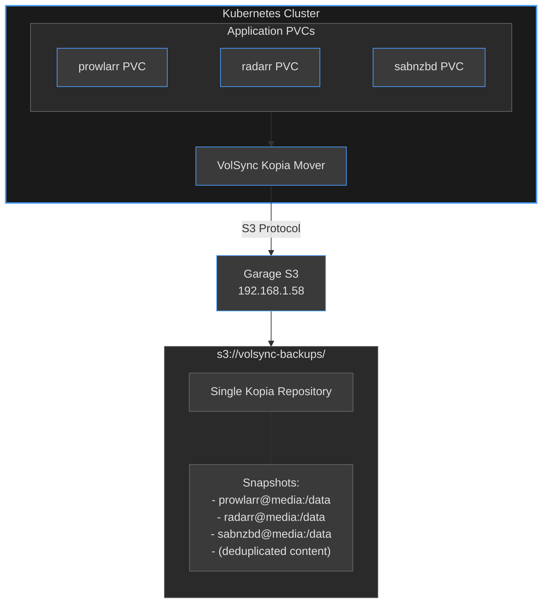

# Backup Strategy Architecture

## Overview

This document describes the backup strategy for the home-ops Kubernetes cluster, including the
architecture, implementation details, and critical learnings from deployment.

## Table of Contents

- [Architecture Overview](#architecture-overview)
- [VolSync with Kopia Backend](#volsync-with-kopia-backend)
- [Storage Backend (Garage S3)](#storage-backend-garage-s3)
- [Shared Repository Pattern](#shared-repository-pattern)
- [Configuration](#configuration)
- [Critical Learnings](#critical-learnings)
- [Troubleshooting](#troubleshooting)

## Architecture Overview

### Components

1. **VolSync** - Kubernetes operator for volume replication and backup
   - Fork: `perfectra1n/volsync` (adds Kopia support)
   - Version: `0.16.8` (container image)
   - Chart: `0.17.11` (from home-operations/charts-mirror)

2. **Kopia** - Content-addressable backup system
   - Version: `v0.21.1`
   - Backend: S3-compatible (Garage)
   - Repository mode: Shared multi-tenant

3. **Garage S3** - Self-hosted S3-compatible object storage
   - Endpoint: `http://192.168.1.58:3900` (Nezuko server)
   - Region: `garage`
   - Bucket: `volsync-backups`

### Data Flow



## VolSync with Kopia Backend

### Why Kopia?

Kopia was chosen over other backup solutions (Restic, Rclone, Rsync) for:

1. **Content-addressable storage** - Deduplication across all backups
2. **Multi-tenancy support** - Single repository, multiple identities
3. **Snapshot-based isolation** - `username@hostname:/path` identification
4. **Compression** - Built-in zstd compression
5. **Performance** - Parallel upload streams

### Kopia Repository Concepts

Kopia has two isolation levels that are critical to understand:

#### 1. Repository-Level Isolation (NOT USED)

Multiple physical repositories, each completely separate:

```txt
s3://bucket/app1/  → Separate Kopia repository
s3://bucket/app2/  → Separate Kopia repository
```

**Pros:**

- Complete isolation
- Independent passwords per app
- Separate retention policies

**Cons:**

- No deduplication across apps
- Management overhead (one bucket per app or complex prefixing)
- **Does not work with VolSync's entry.sh** (strips trailing slashes)

#### 2. Snapshot-Level Isolation (USED)

Single repository with multiple identities:

```txt
s3://bucket/  → One Kopia repository
  ├── prowlarr@media:/data  → Snapshot identity
  ├── radarr@media:/data    → Snapshot identity
  └── sabnzbd@media:/data   → Snapshot identity
```

**Pros:**

- Deduplication across all apps
- Single bucket management
- Shared repository password
- Works perfectly with VolSync

**Cons:**

- All apps must share same repository password
- Cannot have different S3 backends per app

### How VolSync Sets Identity

VolSync automatically sets Kopia's username and hostname from Kubernetes metadata:

```yaml
# ReplicationSource: prowlarr in namespace media
# Results in Kopia identity:
username: prowlarr
hostname: media
# Snapshots: prowlarr@media:/data
```

This provides isolation without requiring app-specific S3 prefixes or buckets.

## Storage Backend (Garage S3)

### Garage Configuration

- **Endpoint**: `http://192.168.1.58:3900`
- **Region**: `garage` (custom region name)
- **Bucket**: `volsync-backups`
- **Credentials**: Stored in `cluster-secrets.sops.yaml`

### Bucket Structure

The bucket contains a **single flat Kopia repository** (NOT per-app directories):

```txt
volsync-backups/
├── kopia.repository          # Repository metadata
├── kopia.blobcfg             # Blob configuration
├── _log_*                    # Kopia log files
├── p*, q*, x*                # Content-addressable data blobs
└── (deduplicated across all apps)
```

**Important**: There are NO app-specific directories. All apps write to the same repository root.

## Shared Repository Pattern

### Configuration Requirements

For the shared repository approach to work, all apps must:

1. **Use identical `KOPIA_REPOSITORY` URL** (no app-specific prefixes)
2. **Use identical `KOPIA_PASSWORD`** (repository-level authentication)
3. **Let VolSync set username/hostname** (automatic from namespace/app name)

### Secret Configuration

```yaml
# kubernetes/components/volsync/secret.yaml
apiVersion: v1
kind: Secret
metadata:
  name: ${APP}-volsync-secret
stringData:
  # CRITICAL: Same password for ALL apps
  KOPIA_PASSWORD: volsync-shared-kopia-password

  # S3 credentials
  AWS_ACCESS_KEY_ID: ${S3_ACCESS_KEY_ID}
  AWS_SECRET_ACCESS_KEY: ${S3_SECRET_ACCESS_KEY}
  AWS_DEFAULT_REGION: ${S3_REGION}

  # CRITICAL: No app-specific prefix - shared repository
  KOPIA_REPOSITORY: s3://volsync-backups/
  KOPIA_S3_ENDPOINT: ${S3_ENDPOINT}
  KOPIA_S3_DISABLE_TLS: "true"
```

### ReplicationSource Configuration

```yaml
apiVersion: volsync.backube/v1alpha1
kind: ReplicationSource
metadata:
  name: prowlarr
  namespace: media
spec:
  sourcePVC: prowlarr
  trigger:
    schedule: "0 * * * *"  # Hourly
  kopia:
    repository: prowlarr-volsync-secret  # References secret above
    compression: zstd-fastest
    copyMethod: Snapshot
    retain:
      hourly: 24
      daily: 7
    # username/hostname auto-set from metadata (prowlarr@media)
```

## Configuration

### Backup Schedule

- **Frequency**: Hourly (`0 * * * *`)
- **Method**: Snapshot-based (using VolumeSnapshot)
- **Compression**: zstd-fastest

### Retention Policy

```yaml
retain:
  hourly: 24   # Keep last 24 hourly backups
  daily: 7     # Keep 7 daily backups
```

### Apps Using VolSync

**Media namespace:**

- jellyseerr
- prowlarr
- qbittorrent
- radarr
- radarr-4k
- radarr-anime
- recyclarr
- sabnzbd
- tautulli

**Default namespace:**

- bookstack

## Critical Learnings

### The Trailing Slash Issue

**Problem**: VolSync's Kopia mover entry.sh script strips trailing slashes from S3 prefixes.

**Code in entry.sh (commit 09ef3a7, Aug 8, 2025):**

```bash
# Remove trailing slash from S3 prefix for consistency
# Kopia handles S3 paths correctly without trailing slashes
if [[ -n "${S3_PREFIX}" ]] && [[ "${S3_PREFIX}" =~ /$ ]]; then
    S3_PREFIX="${S3_PREFIX%/}"
    echo "Removed trailing slash from S3 prefix for consistency"
fi
```

**Official Kopia documentation states:**

> `--prefix` | Prefix to use for objects in the bucket. **Put trailing slash (/) if you want to use
> prefix as directory.** e.g my-backup-dir/ would put repository contents inside my-backup-dir
> directory

**Impact:**

- **WITH trailing slash**: `s3://bucket/app/` → directory prefix → `app/kopia.repository`
- **WITHOUT trailing slash**: `s3://bucket/app` → object name prefix → `appkopia.repository`

**Why this bug exists**: The commit message claims "Kopia handles S3 paths correctly without
trailing slashes" but this **contradicts official Kopia documentation**. The original code was
correct.

**Why it doesn't affect us**: We use the shared repository pattern with NO prefix, so the bug is
irrelevant. Only affects users trying repository-level isolation with S3 prefixes.

### The Password Confusion

**Initial mistake**: Each app had unique password `${APP}-volsync-backup-password`

**Result**: First app (prowlarr) created repository successfully. Second app (radarr-anime) failed
with:

```txt
ERROR error connecting to repository: repository not initialized in the provided storage
```

**Root cause**: Different passwords = Kopia thinks it's a different repository = initialization
fails

**Fix**: Changed to shared password `volsync-shared-kopia-password` for all apps

### Failed Approaches (Sept-Oct 2024)

#### Attempt 1: KOPIA_S3_BUCKET + KOPIA_S3_PREFIX

```yaml
KOPIA_REPOSITORY: s3://volsync-backups/
KOPIA_S3_BUCKET: volsync-backups
KOPIA_S3_PREFIX: ${APP}/
```

**Result**: entry.sh ignores `KOPIA_S3_PREFIX` when `KOPIA_REPOSITORY` is present

#### Attempt 2: Embedded prefix with trailing slash

```yaml
KOPIA_REPOSITORY: s3://volsync-backups/${APP}/
```

**Result**: entry.sh strips trailing slash → object name prefix instead of directory

#### Attempt 3: Separate buckets per app

```yaml
KOPIA_REPOSITORY: s3://volsync-${APP}/
```

**Result**: Works but requires managing multiple buckets, loses deduplication

#### Attempt 4: Dual config with bucket hint

```yaml
KOPIA_REPOSITORY: s3://volsync-backups/${APP}/
KOPIA_S3_BUCKET: volsync-backups
```

**Result**: entry.sh still strips trailing slash

#### Attempt 5: Shared repository (SUCCESS)

```yaml
KOPIA_REPOSITORY: s3://volsync-backups/
KOPIA_PASSWORD: volsync-shared-kopia-password  # Same for all apps
```

**Result**: Works perfectly with snapshot-level isolation

### Discord Clarification

perfectra1n's guidance (Sept 12, 2025) was **correct**:

> "You don't need to manage a bucket prefix per app. You just have everything flow to the same
> 'path', Kopia manages/deduplicates, and PVC/namespace is managed by username/hostname combination
> within Kopia"

We initially misunderstood this as conceptual confusion on his part. In reality:

- He understood Kopia's multi-tenancy correctly
- The shared repository pattern is the **intended design** for VolSync's Kopia mover
- Snapshot-level isolation (username@hostname) is the recommended approach

## Troubleshooting

### Check Backup Status

```bash
# List all ReplicationSources
kubectl get replicationsource -A

# Check specific app status
kubectl describe replicationsource prowlarr -n media

# View recent backup logs
kubectl logs -n media job/volsync-src-prowlarr
```

### Common Issues

#### "Invalid repository password" error

**Cause**: Apps using different passwords for shared repository

**Fix**: Ensure all apps use same `KOPIA_PASSWORD`

```yaml
# BAD - unique passwords
KOPIA_PASSWORD: ${APP}-volsync-backup-password

# GOOD - shared password
KOPIA_PASSWORD: volsync-shared-kopia-password
```

#### "Repository not initialized" error

**Cause**: Either password mismatch or bucket doesn't exist

**Fix**:

1. Verify all apps use same password
2. Ensure S3 bucket exists
3. Check S3 credentials are correct

#### No backup pod starts

**Cause**: Stuck job from previous run

**Fix**: Delete stale job

```bash
kubectl delete job -n media volsync-src-<app>
```

#### Backup pod fails immediately

**Cause**: Usually S3 connection issues

**Debug**:

```bash
# Check pod logs
kubectl logs -n media -l volsync.backube/cleanup=volsync-<app>-src

# Verify secret contents
kubectl get secret <app>-volsync-secret -n media -o yaml
```

### Verify Bucket Contents

```bash
# List bucket contents
rclone tree garage:volsync-backups --max-depth 2

# Expected structure (single repository):
# /
# ├── kopia.repository
# ├── kopia.blobcfg
# ├── _log_* (log files)
# └── p*, q*, x* (data blobs)
```

### Clean Up Failed Pods

```bash
# Delete failed/completed volsync pods
kubectl get pods -n media --no-headers | \
  rg --no-line-number "volsync.*(Error|Completed)" | \
  awk '{print $1}' | \
  xargs -r kubectl delete pod -n media
```

## References

### Documentation

- [Kopia Official Docs - S3
  Repository](https://kopia.io/docs/reference/command-line/common/repository-create-s3/)
- [VolSync perfectra1n fork](https://github.com/perfectra1n/volsync) (appears private/deleted)
- [VolSync upstream PR #1723](https://github.com/backube/volsync/pull/1723) - Kopia implementation

### Related Files

- `kubernetes/components/volsync/secret.yaml` - Secret template with full history
- `kubernetes/components/volsync/replicationsource.yaml` - ReplicationSource template
- `kubernetes/apps/{namespace}/{app}/ks.yaml` - App kustomizations using volsync component

### Key Commits

- `09ef3a7` (Aug 8, 2025) - **Bug introduction**: Trailing slash removal in entry.sh
- Prior commit - **Original correct code**: Added trailing slashes for proper path separation

### Discord Context

- Thread: September 12, 2025
- Participants: wavefront (jfroy), onedr0p, perfectra1n
- Key insight: Shared repository pattern is the intended design

## Future Considerations

### If Switching to Repository-Level Isolation

If you need separate repositories per app in the future:

1. **Report the trailing slash bug** to perfectra1n/volsync
2. **Revert commit 09ef3a7** or patch entry.sh locally
3. **Use per-app passwords** for true isolation
4. **Accept loss of deduplication** across apps

### If Switching S3 Backends

The shared repository pattern requires all apps use the same S3 backend. For multi-backend:

1. **Group apps by backend** into different repositories
2. **Use separate passwords** per repository
3. **Consider upstream fix** for trailing slash bug to enable prefixes

### Monitoring Recommendations

1. **Alert on backup failures**: Monitor ReplicationSource status
2. **Track backup size growth**: Watch S3 bucket usage
3. **Verify retention**: Periodically check snapshot counts
4. **Test restores**: Regular restore testing to validate backups
