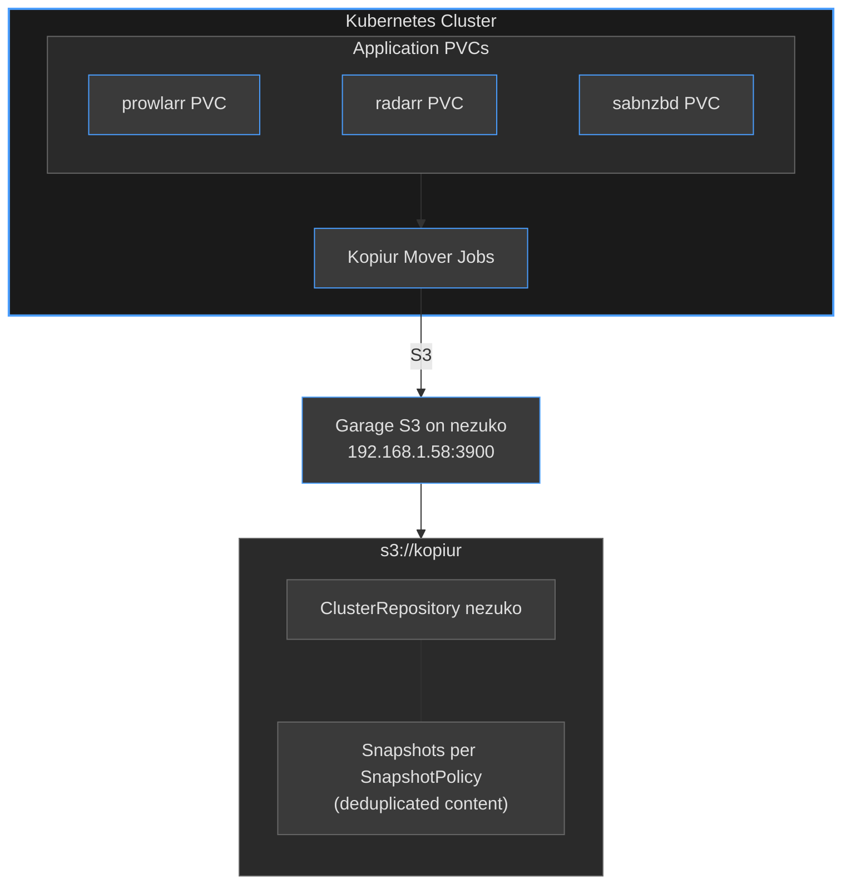

# Backup Strategy Architecture

## Overview

This document describes the backup strategy for the home-ops Kubernetes cluster, including the
architecture, implementation details, and critical learnings from deployment.

## Table of Contents

- [Architecture Overview](#architecture-overview)
- [Kopiur volume backups](#kopiur-volume-backups)
- [CloudNativePG backups](#cloudnativepg-backups)
- [Critical Learnings](#critical-learnings)
- [Troubleshooting](#troubleshooting)

## Architecture Overview

### Components

1. **Kopiur** - Kopia-native backup operator (`kubernetes/apps/storage/kopiur`)
   - Snapshots each app's PVC through a CSI VolumeSnapshot and uploads it with a Kopia mover Job
   - Restores a recreated PVC from the latest snapshot through a volume populator

2. **Garage S3 on nezuko** - Object storage for every backup (`192.168.1.58:3900`)
   - Runs as a Docker container on the NAS, outside the cluster
   - The Garage S3 operator in the cluster provisions buckets and access keys

3. **Barman Cloud Plugin** - PostgreSQL physical backups and continuous WAL archiving
   - Backend: Garage S3
   - Provisioning: Garage S3 operator
   - Recovery: Full cluster restore or point-in-time recovery

### Data Flow

```mermaid
flowchart TB
    subgraph cluster["Kubernetes Cluster"]
        direction TB
        subgraph apps["Application PVCs"]
            direction LR
            prowlarr["prowlarr PVC"] ~~~ radarr["radarr PVC"] ~~~ sabnzbd["sabnzbd PVC"]
        end
        mover["Kopiur Mover Jobs"]
    end

    apps --> mover

    garage["Garage S3 on nezuko<br/>192.168.1.58:3900"]
    mover -->|S3| garage

    subgraph repo["s3://kopiur"]
        direction TB
        metadata["ClusterRepository nezuko"]
        snapshots["Snapshots per SnapshotPolicy<br/>(deduplicated content)"]
        metadata --- snapshots
    end

    garage --> repo

    style cluster fill:#1a1a1a,stroke:#4a9eff,stroke-width:2px,color:#e0e0e0
    style apps fill:#2a2a2a,stroke:#666,stroke-width:1px,color:#e0e0e0
    style repo fill:#2a2a2a,stroke:#666,stroke-width:1px,color:#e0e0e0
    style prowlarr fill:#3a3a3a,stroke:#4a9eff,color:#e0e0e0
    style radarr fill:#3a3a3a,stroke:#4a9eff,color:#e0e0e0
    style sabnzbd fill:#3a3a3a,stroke:#4a9eff,color:#e0e0e0
    style mover fill:#3a3a3a,stroke:#4a9eff,color:#e0e0e0
    style garage fill:#3a3a3a,stroke:#4a9eff,color:#e0e0e0
    style metadata fill:#3a3a3a,stroke:#666,color:#e0e0e0
    style snapshots fill:#3a3a3a,stroke:#666,color:#e0e0e0
```

## Kopiur volume backups

### Repository

Every app backs up into one shared Kopia repository, `ClusterRepository/nezuko`
(`kubernetes/apps/storage/kopiur-repository`). Kopia deduplicates content across all apps and
separates them by snapshot identity. The repository lives in the Garage `kopiur` bucket. The Garage
S3 operator creates the bucket and its access key; the repository password comes from Infisical
(`/storage/kopiur/repository-password`). Losing that password makes every snapshot unreadable, so
keep a copy outside the cluster.

Kopiur copies the repository Secrets into each app namespace when a mover Job runs there
(credential projection), so apps need no backup Secrets of their own.

The repository also sets:

- **Mover cache:** a persistent 5Gi `ceph-block` PVC per app, with Kopia capped at 512 MiB of
  content cache and 1024 MiB of metadata cache. Kopia's 5000 MiB defaults are larger than the PVC.
- **Maintenance:** quick maintenance hourly and full maintenance daily at 05:00, after backups.

### The kopiur component

Apps opt in with `kubernetes/components/kopiur`. For `APP: example`, it declares:

1. `SnapshotPolicy/example`: backs up the PVC with a CSI snapshot and zstd-fastest compression.
2. `SnapshotSchedule/example`: runs the policy daily during the 01:00 hour (America/Chicago); `H`
   spreads apps across the hour.
3. `Restore/example`: restores the latest snapshot, or provisions an empty volume when none exists.
4. `PersistentVolumeClaim/example`: the backed-up PVC itself, with `Restore/example` as its
   `dataSourceRef`. A recreated PVC therefore comes back with its data.

Flux only creates the PVC (`kustomize.toolkit.fluxcd.io/ssa: IfNotPresent`), because a PVC spec
cannot change after creation. To resize it, patch the live PVC, then update `KOPIUR_CAPACITY` so a
recreated PVC gets the same size.

Substitution variables set the PVC shape: `KOPIUR_PVC` (default `APP`), `KOPIUR_CAPACITY` (`5Gi`),
`KOPIUR_ACCESSMODES` (`ReadWriteOnce`), `KOPIUR_STORAGECLASS` (`ceph-block`), and
`KOPIUR_SNAPSHOTCLASS` (`csi-ceph-blockpool`).

Retention keeps the latest snapshot plus 7 daily, 4 weekly, and 3 monthly snapshots. Kopiur
enforces it by pruning the `Snapshot` objects each policy produced.

Backup coverage is derived from applications that include the `kopiur` component.

## CloudNativePG backups

PostgreSQL databases use the Barman Cloud plugin rather than Kopia volume snapshots. The plugin
takes database-consistent physical base backups and continuously archives PostgreSQL write-ahead
logs (WAL), which supports point-in-time recovery.

Applications opt in through the `cnpg-backup` Kustomize component. For each application, the
component declares:

1. A Garage access-key request. The Garage S3 operator creates its Kubernetes credential Secret.
2. A Garage bucket named `${APP}-postgres-backups`.
3. A Barman `ObjectStore`, which configures access to that bucket and a 30-day recovery window.
4. A daily `ScheduledBackup` at 01:00 (America/Chicago, via the operator's `TZ`) and a WAL
   archiver on `${APP}-postgres`.

The bucket is the storage location. The ObjectStore is the connection and policy resource used by
Barman; it does not create another storage copy. See the [component contract][cnpg-component] and
[recovery runbook][cnpg-recovery].

Database backup coverage is derived from applications that include the `cnpg-backup` component. Use
`./scripts/hops.sh backup status` for the current inventory. Garage object data and the Kopia
repository reside on the same NAS, so neither mechanism supplies an offsite copy.

## Critical Learnings

### VolSync to Kopiur (October 2026)

Volume backups previously ran through the perfectra1n VolSync fork into a filesystem Kopia
repository on NFS (`/mnt/user/volsync`). Mover caches filled their 5Gi PVCs because Kopia's default
cache budgets exceed the volume and the shared repository's index grows with every app; VolSync
offers no way to set those budgets. Kopiur does, and it adds populator-based restores. The Kopiur
repository started empty; the old repository stayed on NFS only until Kopiur held its first
snapshots.

### Garage moved to nezuko (October 2026)

Garage first ran in the cluster with its object data on an NFS mount of `/mnt/user/s3`. It now runs
as a Docker container on nezuko next to its data. Two Garage servers must never share one data
directory, so the cluster instance was removed before the nezuko container started.

## Troubleshooting

Kopiur reports state on its resources. `ClusterRepository/nezuko` shows repository health and
reachability, each `SnapshotPolicy` shows its last successful snapshot, and each `Snapshot` shows
its phase and mover Job. The Kopiur chart ships the backup alerts and a Grafana dashboard.

A mover cache that fills its PVC means the cache budgets no longer fit; lower them in the
`ClusterRepository` `moverDefaults.cache` rather than growing the PVC.

## References

- [Kopiur documentation][kopiur-docs]
- [CNPG backup component][cnpg-component]
- [CNPG recovery runbook][cnpg-recovery]

[kopiur-docs]: https://github.com/home-operations/kopiur/tree/main/docs
[cnpg-component]: ../../kubernetes/components/cnpg-backup/README.md
[cnpg-recovery]: ../runbooks/cnpg-recovery.md
