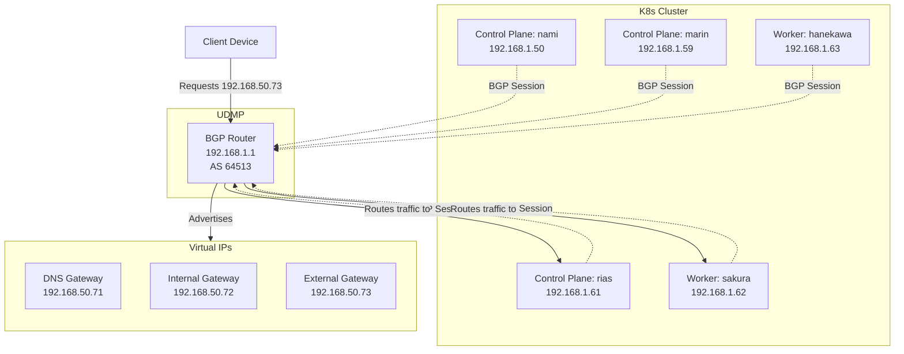

# BGP Load Balancing Architecture

## Overview

This document describes the BGP-based load balancing architecture for exposing Kubernetes services
with virtual IPs. The architecture uses Cilium's BGP Control Plane to peer with the UniFi Dream
Machine Pro (UDMP) router, providing sub-second failover for gateway services.

## Design Rationale

The BGP architecture replaced Layer 2 announcements to achieve faster failover and more reliable
routing:

- **Failover performance**: BGP provides 9-12 second failover vs L2's 10-20 seconds
- **Router-managed**: UDMP maintains routing table vs client-side ARP caching
- **Industry standard**: Same protocol used by cloud providers and enterprise networks
- **Scalable**: Works across network segments without broadcast limitations

## Architecture Diagram



## BGP Configuration

### Autonomous System Numbers

- **UDMP**: AS 64513 (private ASN range 64512-65534)
- **Kubernetes**: AS 64514

ASNs are arbitrary identifiers for routing domains. Private ASNs (64512-65534) are safe for internal
networks, similar to RFC1918 private IP ranges.

### BGP Timers

Configured for fast failure detection in datacenter environments:

```yaml
timers:
  connectRetryTimeSeconds: 5   # Reconnection attempts
  holdTimeSeconds: 9           # Session timeout
  keepAliveTimeSeconds: 3      # Health check interval
```

These aggressive timers enable ~9-12 second failover when nodes fail.

### Peer Sessions

Each Kubernetes node establishes a BGP session with the UDMP:

- 5 total sessions (3 control plane + 2 worker nodes)
- All nodes advertise same LoadBalancer IPs
- UDMP selects one active route per IP (typically lowest node IP)
- Other routes remain as backups for instant failover

## Traffic Flow

### Normal Operation

1. Client sends packet to VIP (e.g., 192.168.50.73)
2. UDMP checks routing table: "192.168.50.73 → Node sakura (192.168.1.62)"
3. UDMP forwards packet to sakura
4. Cilium on sakura load balances to service pods cluster-wide

### Node Failure Scenario

1. Node sakura fails
2. BGP session drops (detected within 9 seconds via holdTimer)
3. UDMP removes sakura's routes from routing table
4. UDMP switches to backup route (e.g., Node hanekawa)
5. Traffic resumes to hanekawa (~9-12 second total failover)

### Comparison to L2 Announcements

| Aspect             | L2 Announcements  | BGP                      |
| ------------------ | ----------------- | ------------------------ |
| **Failover**       | 10-20 seconds     | 9-12 seconds             |
| **Mechanism**      | ARP cache timeout | BGP session monitoring   |
| **Decision point** | Client-side       | Router-side              |
| **Scalability**    | Same L2 segment   | Routable across segments |
| **Protocol**       | ARP (broadcast)   | TCP (unicast)            |

## IP Pool Management

LoadBalancer IPs are allocated from `CiliumLoadBalancerIPPool`:

```yaml
apiVersion: cilium.io/v2alpha1
kind: CiliumLoadBalancerIPPool
metadata:
  name: infrastructure-static-pool
spec:
  blocks:
  - start: "192.168.50.71"  # DNS gateway
    stop: "192.168.50.79"   # Infrastructure range
```

Services request specific IPs via annotation:

```yaml
metadata:
  annotations:
    lbipam.cilium.io/ips: 192.168.50.73
```

## Operational Notes

### Verifying BGP Sessions

Check BGP peer status on any node:

```bash
kubectl exec -n kube-system ds/cilium -- cilium-dbg bgp peers
```

Expected output shows 5 established sessions:

```txt
Local AS   Peer AS   Peer Address    Session       Uptime
64514      64513     192.168.1.1     established   5m12s
```

### Verifying UDMP Configuration

Check BGP status via UniFi UI:

Network → Settings → Policy Engine → BGP → View Status

Or via UDMP CLI:

```bash
# Method depends on UniFi OS version
# Native BGP (4.1.13+): Check UI
# FRR method: docker exec -it frr vtysh -c "show bgp summary"
```

### Node Maintenance

When cordoning/draining nodes for maintenance:

1. Node stops accepting new workloads (cordon)
2. Pods drain to other nodes
3. BGP session remains active during drain
4. Shutdown command triggers BGP session drop
5. UDMP switches routes to active nodes (~9s)

## Configuration Files

### Cilium BGP Configuration

Location: `kubernetes/apps/kube-system/cilium/bgp.yaml`

Contains four CRDs:

1. **CiliumBGPAdvertisement**: Defines what to advertise (LoadBalancer IPs)
2. **CiliumBGPPeerConfig**: Configures timers and address families
3. **CiliumBGPClusterConfig**: Defines peers and ASN
4. Requires `CiliumLoadBalancerIPPool` (in networks.yaml)

### UDMP BGP Configuration

Location: `bootstrap/udmp/bgp.conf`

Uploaded via UniFi UI (Network → Settings → Policy Engine → BGP) or configured via FRR for older
firmware versions.

## Troubleshooting

### BGP Sessions Not Establishing

Check Cilium BGP status:

```bash
kubectl exec -n kube-system ds/cilium -- cilium-dbg bgp peers
```

If sessions show "Idle" or "Connect":

- Verify UDMP has BGP config uploaded
- Check ASN numbers match (64513 UDMP, 64514 K8s)
- Verify node IPs are correct in both configs
- Check firewall rules allow TCP port 179

### Services Not Reachable After BGP Migration

Verify LoadBalancer IPs are advertised:

```bash
kubectl exec -n kube-system ds/cilium -- cilium-dbg bgp routes advertised ipv4 unicast
```

Check UDMP routing table has entries for your VIPs.

### Slow Failover

If failover exceeds 15 seconds, verify BGP timers in `CiliumBGPPeerConfig` are set to aggressive
datacenter values (5s/9s/3s).

## References

- [Cilium BGP Control Plane Documentation][cilium-bgp]
- [UniFi BGP Documentation][unifi-bgp]
- [onedr0p/home-ops BGP Configuration][onedr0p-bgp]

[cilium-bgp]: https://docs.cilium.io/en/stable/network/bgp-control-plane/
[unifi-bgp]: https://help.ui.com/hc/en-us/articles/16271338193559
[onedr0p-bgp]:
    https://github.com/onedr0p/home-ops/blob/main/kubernetes/apps/kube-system/cilium/app/networking.yaml
