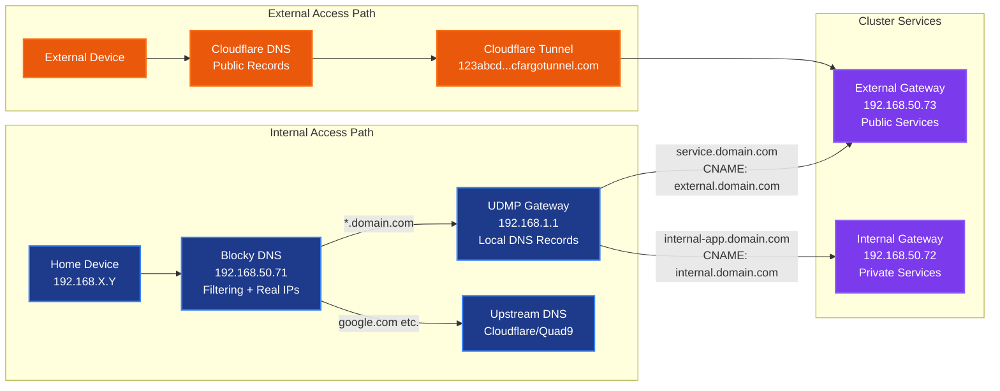
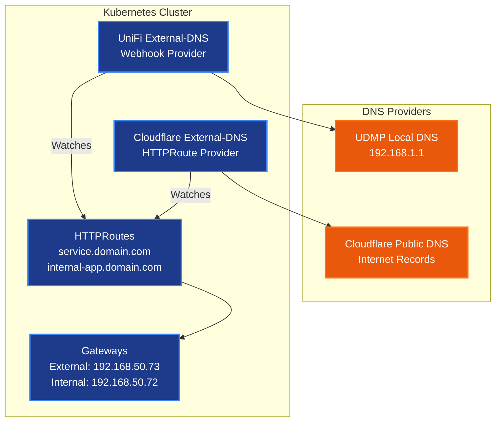
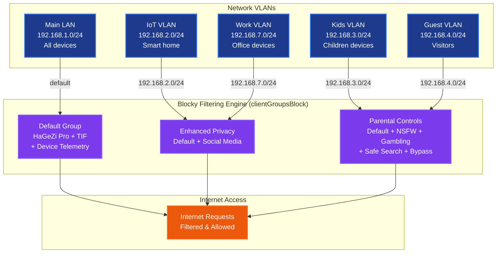

# DNS Architecture

## Overview

This document describes the DNS architecture and resolution flow for services running in the
cluster. The architecture uses Blocky for DNS filtering with CIDR-based client groups and
conditional forwarding for local domain resolution.

## Design Challenges

The DNS architecture solves two fundamental problems:

- **Local traffic efficiency**: Internal requests to `domain.com` services must short-circuit to
  local cluster gateways instead of routing through external Cloudflare infrastructure
- **Subnet-specific filtering**: Different VLANs require distinct content filtering policies,
  demanding DNS server solutions that preserve client source IPs

## DNS Resolution Flow



## External-DNS Integration Architecture



## VLAN-Based Filtering



The cameras VLAN (192.168.5.0/24) is excluded from Blocky entirely; internet access for cameras is
blocked at the router level.

## Architecture Concepts

### DNS Resolution Strategy

The architecture implements a dual-path DNS resolution system:

- **Internal Path**: Home devices connect directly to Blocky for filtering and conditional
  forwarding to local DNS records
- **External Path**: Internet clients resolve through Cloudflare DNS to tunnel endpoints
- **Client IP Preservation**: Direct connections to Blocky enable real source IP visibility for
  CIDR-based filtering

### External-DNS Integration

A dual-provider external-dns setup automatically manages DNS records:

- **UniFi Provider**: Watches all HTTPRoutes and creates local DNS records in UDMP
- **Cloudflare Provider**: Watches external HTTPRoutes and creates public DNS records
- **Target Inheritance**: HTTPRoutes inherit gateway targets automatically without explicit
  configuration

### VLAN Filtering Strategy

Blocky's `clientGroupsBlock` maps CIDR ranges to blocklist groups, enabling subnet-specific content
filtering without client-level configuration:

- **Default Group**: Baseline protection for main LAN with HaGeZi Pro, TIF, and device telemetry
  lists
- **Enhanced Privacy**: Social media blocking added for IoT and work networks
- **Parental Controls**: Comprehensive content restrictions for kids and guest networks (NSFW,
  gambling, safe search enforcement, DoH/VPN bypass prevention)

## Core Components

### Blocky DNS Server

Stateless DNS proxy providing ad/tracker blocking, CIDR-based VLAN filtering, and conditional
forwarding. Deployed as a 2-replica Deployment with pod anti-affinity for node distribution.

**Key Features**:

- Real source IP preservation for CIDR-based filtering
- Conditional forwarding to UDMP for local domain resolution
- HaGeZi Pro + TIF blocklists (944k+ entries) with automatic updates
- `customDNS` with `filterUnmappedTypes` to prevent IPv6/HTTPS record leaks through UDMP
- PostgreSQL query logging via CloudNativePG
- Per-replica independent caching with prefetching

### DNS Gateway Service

Provider-agnostic LoadBalancer service that separates infrastructure from application concerns,
enabling zero-downtime DNS provider switching.

### Envoy Gateway Infrastructure

Dual gateway architecture for service exposure:

- **External Gateway**: WAN/tunnel accessible services
- **Internal Gateway**: LAN-only services

### External-DNS Providers

Automated DNS record management across multiple providers:

- **UniFi External-DNS**: Local DNS records in UDMP
- **Cloudflare External-DNS**: Public DNS records for internet access

## Resolution Decision Logic

### Internal Client Resolution

When home devices query DNS through Blocky:

1. **Custom DNS** (`external.domain.com`, `internal.domain.com`): Resolved directly by Blocky (never
   reaches UDMP); `filterUnmappedTypes` blocks AAAA/HTTPS for these entries
2. **Local domains** (`*.domain.com`): Conditional forwarder to UDMP local records
3. **Internet domains** (`google.com`): Upstream to Cloudflare/Quad9 via DoH

### External Client Resolution

When internet clients query DNS through Cloudflare:

1. **Service domains** (`service.domain.com`): Cloudflare DNS to tunnel endpoint

### Client IP Preservation

Direct client connections to Blocky eliminate proxy masking:

- Clients connect directly to Blocky (192.168.50.71)
- Real source IPs enable CIDR-based `clientGroupsBlock` filtering
- No UDMP DNS forwarding to mask client identities

## Network Segmentation

### VLAN Filtering Rules

Blocky applies subnet-specific filtering via `clientGroupsBlock` based on client source IP CIDR:

- **Main LAN (192.168.1.0/24)**: Default group (HaGeZi Pro + TIF + device telemetry)
- **Kids VLAN (192.168.3.0/24)**: Default + NSFW, social, gambling, safe search, bypass prevention
- **IoT/Work VLANs (192.168.2.0/24, 192.168.7.0/24)**: Default + social media blocking
- **Guest VLAN (192.168.4.0/24)**: Ads, threats, NSFW, gambling
- **Cameras VLAN (192.168.5.0/24)**: Excluded (blocked at router level)

## Architecture Benefits

- **Client IP Preservation**: Direct client connections enable real source IP visibility
- **CIDR-Native Filtering**: Subnet-specific blocking via `clientGroupsBlock` without per-client
  configuration
- **Stateless HA**: Independent replicas with no coordination; Cilium random backend selection
- **Pure GitOps**: YAML-only configuration with no imperative state or sync tooling
- **Zero-Downtime Capable**: Infrastructure changes without service interruption
- **IPv6 Leak Prevention**: `filterUnmappedTypes` blocks AAAA/HTTPS before UDMP forwarding
- **Query Logging**: PostgreSQL via CloudNativePG for structured query analysis
- **Tunnel Compatible**: Proper CNAME chains for Cloudflare tunnel architecture
- **Intelligent Forwarding**: Conditional forwarding for local domain resolution

---

## Implementation Details

### Blocky Configuration

**Deployment**: `kubernetes/apps/dns-private/blocky/`

- **Image**: `ghcr.io/0xerr0r/blocky`
- **Replicas**: 2 (RollingUpdate, pod anti-affinity across nodes)
- **Priority**: system-cluster-critical
- **DNS Port**: `5353` (target), exposed as `53` via dns-gateway
- **HTTP Port**: `4000` (metrics, API)
- **Component Label**: `app.kubernetes.io/component: dns-server`

**Init Container Pattern**: An `envsubst` init container renders the config template with the
PostgreSQL connection URI from the CNPG-generated secret (`blocky-postgres-app`). The template uses
`$${DATABASE_URL}` (double-dollar escaping to survive Flux `postBuild.substitute`).

**Upstream DNS Configuration**:

```yaml
upstreams:
  groups:
    default:
    - https://1.1.1.1/dns-query
    - https://9.9.9.9/dns-query
```

Blocky queries all upstreams in parallel and uses the fastest response (`parallel_best` strategy).

**Conditional Forwarding**:

```yaml
conditional:
  mapping:
    ${SECRET_DOMAIN}: tcp+udp:192.168.1.1
```

**Custom DNS with IPv6 Leak Prevention**:

```yaml
customDNS:
  # filterUnmappedTypes: true (default) blocks AAAA/HTTPS for mapped entries
  mapping:
    external.${SECRET_DOMAIN}: 192.168.50.73
    internal.${SECRET_DOMAIN}: 192.168.50.72
```

The `filterUnmappedTypes` default (`true`) blocks AAAA and HTTPS queries for `customDNS` entries.
This prevents UDMP from forwarding these record types upstream to Cloudflare, which would return
CNAME chains pointing to unreachable IPv6 tunnel addresses. See [troubleshooting][opencloud-ipv6]
for detailed root cause analysis.

**Blocking Configuration**:

Blocky uses HaGeZi blocklists organized into groups, mapped to VLANs via `clientGroupsBlock`:

| Group        | List                      | Entries  |
|--------------|---------------------------|----------|
| ads          | HaGeZi Pro                | ~190,000 |
| threats      | HaGeZi TIF                | ~590,000 |
| social       | HaGeZi Social             | ~900     |
| nsfw         | HaGeZi NSFW               | ~70,000  |
| gambling     | HaGeZi Gambling Medium    | ~76,000  |
| nosafesearch | HaGeZi No Safe Search     | ~200     |
| bypass       | HaGeZi DoH/VPN/Proxy      | ~15,500  |
| telemetry    | HaGeZi Native (8 vendors) | ~2,100   |

**Query Logging**:

```yaml
queryLog:
  type: postgresql
  target: ${DATABASE_URL}
  logRetentionDays: 7
```

Queries are buffered and flushed to PostgreSQL every 30 seconds (default `flushInterval`). The
PostgreSQL cluster is managed by CloudNativePG (`blocky-postgres`).

### DNS Gateway Service Configuration

**Configuration**: `kubernetes/apps/dns-private/dns-gateway/service.yaml`

- **Type**: LoadBalancer
- **VIP**: `192.168.50.71` (Cilium LBIPAM)
- **Traffic Policy**: Cluster (workaround for [Cilium #27800][cilium-27800]; DSR + Geneve tunneling
  preserves source IP)
- **Selector**: `app.kubernetes.io/component: dns-server`, `app.kubernetes.io/controller: blocky`
- **Ports**: TCP/UDP 53 -> 5353

**Benefits**:

- Zero-downtime DNS provider switching via label selector change
- Infrastructure/application separation

### Envoy Gateway Configuration

**External Gateway** (`kubernetes/apps/network/envoy-gateway/external.yaml`):

- **VIP**: `192.168.50.73`
- **Target**: `external.domain.com`
- **Purpose**: WAN/tunnel accessible services

**Internal Gateway** (`kubernetes/apps/network/envoy-gateway/internal.yaml`):

- **VIP**: `192.168.50.72`
- **Target**: `internal.domain.com`
- **Purpose**: LAN-only services

**EnvoyProxy Configuration**:

- **Traffic Policy**: Cluster (via parametersRef)
- **TLS**: Wildcard certificate for `*.domain.com`

### External-DNS Architecture

#### Cloudflare External-DNS

**HTTPRoute Instance** (`kubernetes/apps/network/cloudflare-dns/httproute.yaml`):

- **Sources**: `gateway-httproute`
- **Filter**: `--gateway-name=external`
- **Purpose**: External HTTPRoutes -> Cloudflare DNS (internet access)
- **TxtOwnerId**: `default`
- **Record Pattern**: `service.domain.com` -> CNAME -> `external.domain.com`

**CRD Instance** (`kubernetes/apps/network/cloudflare-dns/crd.yaml`):

- **Sources**: `crd`
- **Namespace**: `network`
- **Purpose**: Gateway A records -> Cloudflare DNS
- **TxtOwnerId**: `cloudflare`
- **Record Pattern**: `external.domain.com` -> CNAME -> `tunnel.cfargotunnel.com`

**Manual Records** (Cloudflare dashboard):

- **Tunnel endpoint**: Managed via Cloudflare Tunnel configuration

#### UniFi External-DNS

**Single Instance** (`kubernetes/apps/dns-private/external-dns/helmrelease.yaml`):

- **Provider**: `webhook` (UniFi webhook)
- **Sources**: `gateway-httproute`
- **Purpose**: All HTTPRoutes -> UDMP local DNS records
- **TxtOwnerId**: `dns-private`
- **API**: UDMP REST API for DNS record management

### UDMP Local DNS Records

```txt
# Manual entries (infrastructure)
external.domain.com     A      192.168.50.73
internal.domain.com     A      192.168.50.72

# External-DNS managed (Kubernetes services)
service.domain.com      CNAME  external.domain.com
internal-app.domain.com CNAME  internal.domain.com
k8s.cname-service.*           TXT    "heritage=external-dns..."
```

### Target Inheritance Pattern

#### Gateway Configuration

Gateways define target annotations that HTTPRoutes automatically inherit:

```yaml
# External Gateway
apiVersion: gateway.networking.k8s.io/v1
kind: Gateway
metadata:
  annotations:
    external-dns.alpha.kubernetes.io/target: external.domain.com

# Internal Gateway
apiVersion: gateway.networking.k8s.io/v1
kind: Gateway
metadata:
  annotations:
    external-dns.alpha.kubernetes.io/target: internal.domain.com
```

#### HTTPRoute Inheritance

HTTPRoutes inherit targets from their parent Gateway without explicit configuration:

```yaml
apiVersion: gateway.networking.k8s.io/v1
kind: HTTPRoute
metadata:
  name: my-service
  # NO target annotation - inherits from Gateway
spec:
  parentRefs:
  - name: external  # Inherits external.domain.com
  hostnames: ["service.domain.com"]
```

## Traffic Flow Examples

### External Service Access

**Internal Client to External Service** (e.g., `home.domain.com`):

```txt
MacBook -> Blocky (.71) -> Returns .73 -> Direct connection to .73 -> K8s external gateway
```

**External Client to External Service**:

```txt
Android -> Cloudflare DNS -> Returns Cloudflare IPs -> Tunnel -> .73 -> K8s external gateway
```

### Internal Service Access

**Internal Client to Internal Service** (e.g., `dashboard.domain.com`):

```txt
MacBook -> Blocky (.71) -> Returns .72 -> Direct connection to .72 -> K8s internal gateway
```

## DNS Record Distribution

### External HTTPRoutes

HTTPRoutes with `parentRefs: external` create records in both DNS providers:

- **Cloudflare DNS**: `service.domain.com` -> CNAME -> `external.domain.com` (internet access)
- **UDMP Local DNS**: `service.domain.com` -> CNAME -> `external.domain.com` (LAN access)

### Internal HTTPRoutes

HTTPRoutes with `parentRefs: internal` create records only locally:

- **UDMP Local DNS**: `internal-app.domain.com` -> CNAME -> `internal.domain.com` (LAN only)

### Gateway Infrastructure Records

- **Cloudflare**: `external.domain.com` -> CNAME -> `123abcd...cfargotunnel.com`
- **UDMP**: `external.domain.com` -> A -> `192.168.50.73`
- **UDMP**: `internal.domain.com` -> A -> `192.168.50.72`

## Key Design Principles

### External-DNS Configuration

- **Target annotations**: Only on Gateways, never on HTTPRoutes
- **Source configuration**: Use `gateway-httproute` exclusively
- **Inheritance pattern**: HTTPRoutes automatically inherit Gateway targets
- **CNAME enforcement**: Prevents A record fallbacks to LoadBalancer IPs

### Component-Based Architecture

- **Provider abstraction**: Use `app.kubernetes.io/component: dns-server` for service selection
- **Zero-downtime migrations**: Enable seamless DNS provider switching
- **Infrastructure separation**: Decouple dns-gateway service from dns-server applications

[opencloud-ipv6]: /docs/troubleshooting/opencloud-desktop-ipv6-auth-failure-2026-01-25.md
[cilium-27800]: https://github.com/cilium/cilium/issues/27800
