# DNS Architecture

## Overview

This document describes the DNS architecture and resolution flow for services running in the
cluster. The architecture uses AdGuard Home for DNS filtering with VLAN-based client rules and
conditional forwarding for local domain resolution.

## Design Challenges

The DNS architecture solves two fundamental problems:

- **Local traffic efficiency**: Internal requests to `domain.com` services must short-circuit to
  local cluster gateways instead of routing through external Cloudflare infrastructure
- **Subnet-specific filtering**: Different VLANs require distinct content filtering policies,
  demanding DNS server solutions that preserve client source IPs

## DNS Resolution Flow

```mermaid
flowchart LR
    subgraph Internal["🏠 Internal Access Path"]
        direction TB
        Client[Home Device<br/>192.168.X.Y]
        AGH[AdGuard Home<br/>192.168.50.71<br/>🛡️ Filtering + Real IPs]
        UDMP[UDMP Gateway<br/>192.168.1.1<br/>📋 Local DNS Records]

        Client --> AGH
        AGH -->|"*.domain.com"| UDMP
        AGH -->|"google.com etc."| Upstream[☁️ Upstream DNS<br/>Cloudflare/Quad9]
    end

    subgraph External["🌐 External Access Path"]
        direction TB
        ExternalClient[External Device<br/>📱 Phone/Laptop]
        CloudflareDNS[Cloudflare DNS<br/>🌍 Public Records]
        CFTunnel[🔒 Cloudflare Tunnel<br/>123abcd...cfargotunnel.com]

        ExternalClient --> CloudflareDNS
        CloudflareDNS --> CFTunnel
    end

    subgraph ClusterServices["🎯 Cluster Services"]
        direction TB
        ExtGW[External Gateway<br/>192.168.50.73<br/>🌐 Public Services]
        IntGW[Internal Gateway<br/>192.168.50.72<br/>🏠 Private Services]
    end

    %% Internal resolution paths
    UDMP -->|"service.domain.com<br/>CNAME: external.domain.com"| ExtGW
    UDMP -->|"internal-app.domain.com<br/>CNAME: internal.domain.com"| IntGW

    %% External resolution path
    CFTunnel --> ExtGW

    %% Styling
    classDef internal fill:#1e3a8a,stroke:#3b82f6,stroke-width:2px,color:#ffffff
    classDef external fill:#ea580c,stroke:#f97316,stroke-width:2px,color:#ffffff
    classDef services fill:#7c3aed,stroke:#8b5cf6,stroke-width:2px,color:#ffffff

    class Client,AGH,UDMP,Upstream internal
    class ExternalClient,CloudflareDNS,CFTunnel external
    class ExtGW,IntGW services
```



## External-DNS Integration Architecture


## VLAN-Based Filtering

```mermaid
flowchart TD
    subgraph VLANs["🌐 Network VLANs"]
        direction LR
        Main[Main LAN<br/>192.168.1.0/24<br/>All devices]
        Kids[Kids VLAN<br/>192.168.3.0/24<br/>Children devices]
        IoT[IoT VLAN<br/>192.168.2.0/24<br/>Smart home]
        Work[Work VLAN<br/>192.168.7.0/24<br/>Office devices]
        Guest[Guest VLAN<br/>192.168.4.0/24<br/>Visitors]
        Cameras[Cameras VLAN<br/>192.168.5.0/24<br/>Security cameras]
    end

    subgraph AGH["🛡️ AdGuard Home Filtering Engine"]
        direction LR
        Global[Global Rules<br/>590,523 total<br/>HaGeZi Multi Light + TIF]
        Social[Social Media Blocking<br/>Facebook, Twitter, Instagram<br/>Snapchat, TikTok, LinkedIn]
        Parental[Parental Controls<br/>Safe Search + Adult Content<br/>YouTube, Discord, Reddit]
        Minimal[Minimal Filtering<br/>Malware protection only]
    end

    subgraph Output["🌍 Internet Access"]
        direction LR
        Internet[Internet Requests<br/>Filtered & Allowed]
    end

    Main -->|192.168.1.0/24| Global
    Kids -->|192.168.3.0/24| Parental
    IoT -->|192.168.2.0/24| Social
    Work -->|192.168.7.0/24| Social
    Guest -->|192.168.4.0/24| Parental
    Cameras -->|192.168.5.0/24| Minimal

    Global --> Internet
    Social --> Internet
    Parental --> Internet
    Minimal --> Internet

    %% Styling
    classDef vlans fill:#1e3a8a,stroke:#3b82f6,stroke-width:2px,color:#ffffff
    classDef filtering fill:#7c3aed,stroke:#8b5cf6,stroke-width:2px,color:#ffffff
    classDef output fill:#ea580c,stroke:#f97316,stroke-width:2px,color:#ffffff

    class Main,Kids,IoT,Work,Guest,Cameras vlans
    class ClientID,Global,Social,Parental,Minimal filtering
    class Internet output
```



## Architecture Concepts

### DNS Resolution Strategy

The architecture implements a dual-path DNS resolution system:

- **Internal Path**: Home devices connect directly to AdGuard Home for filtering and conditional
  forwarding to local DNS records
- **External Path**: Internet clients resolve through Cloudflare DNS to tunnel endpoints
- **Client IP Preservation**: Direct connections to AdGuard Home enable real source IP visibility
  for VLAN-based filtering

### External-DNS Integration

A dual-provider external-dns setup automatically manages DNS records:

- **UniFi Provider**: Watches all HTTPRoutes and creates local DNS records in UDMP
- **Cloudflare Provider**: Watches external HTTPRoutes and creates public DNS records
- **Target Inheritance**: HTTPRoutes inherit gateway targets automatically without explicit
  configuration

### VLAN Filtering Strategy

Network segmentation enables subnet-specific content filtering:

- **Global Rules**: Baseline protection for main LAN with 590,523+ filtering rules
- **Enhanced Privacy**: Social media blocking for IoT and work networks
- **Parental Controls**: Comprehensive content restrictions for kids and guest networks
- **Minimal Filtering**: Camera-compatible protection with malware blocking only

## Core Components

### AdGuard Home DNS Server

Primary DNS server providing ad/tracker blocking, VLAN-based filtering, and conditional forwarding.

**Key Features**:

- Real source IP preservation for VLAN-based filtering
- Conditional forwarding to UDMP for local domain resolution
- 590,523+ filtering rules with automatic updates
- Subnet-specific client configurations

### DNS Gateway Service

Provider-agnostic LoadBalancer service that separates infrastructure from application concerns,
enabling zero-downtime DNS provider switching.

### Envoy Gateway Infrastructure

Dual gateway architecture for service exposure:

- **External Gateway**: WAN/tunnel accessible services
- **Internal Gateway**: LAN-only services

### External-DNS Providers

Automated DNS record management across multiple providers:

- **UniFi External-DNS**: Local DNS records in UDMP
- **Cloudflare External-DNS**: Public DNS records for internet access

## Resolution Decision Logic

### Internal Client Resolution

When home devices query DNS through AdGuard Home:

1. **Local domains** (`*.domain.com`): Conditional forwarder → UDMP local records
2. **Service domains** (`service.domain.com`): UDMP CNAME → gateway IP
3. **Internet domains** (`google.com`): Upstream → Cloudflare/Quad9

### External Client Resolution

When internet clients query DNS through Cloudflare:

1. **Service domains** (`service.domain.com`): Cloudflare DNS → tunnel endpoint

### Client IP Preservation

Direct client connections to AdGuard Home eliminate proxy masking:

- Clients connect directly to AdGuard Home (192.168.50.71)
- Real source IPs enable VLAN-based filtering rules
- No UDMP DNS forwarding to mask client identities

## Network Segmentation

### VLAN Filtering Rules

AdGuard Home applies subnet-specific filtering based on client source IP:

- **Main LAN (192.168.1.0/24)**: Global filtering (590,523 rules)
- **Kids VLAN (192.168.3.0/24)**: Enhanced blocking + parental controls
- **IoT/Work VLANs (192.168.2.0/24, 192.168.7.0/24)**: Privacy-enhanced filtering
- **Guest VLAN (192.168.4.0/24)**: Basic protection + adult content blocking
- **Cameras VLAN (192.168.5.0/24)**: Minimal filtering for compatibility

## Architecture Benefits

- **Client IP Preservation**: Direct client connections enable real source IP visibility
- **VLAN-Based Filtering**: Subnet-specific ad/tracker blocking and content restrictions
- **Zero-Downtime Capable**: Infrastructure changes without service interruption
- **Advanced Filtering**: 590,523+ filtering rules with automatic updates
- **Tunnel Compatible**: Proper CNAME chains for Cloudflare tunnel architecture
- **Intelligent Forwarding**: Conditional forwarding for local domain resolution
- **High Performance**: Direct DNS resolution without proxy overhead
- **Secure**: Encrypted secrets management and namespace isolation
- **Family-Friendly**: Comprehensive parental controls and safe search enforcement

---

## Implementation Details

### AdGuard Home Configuration

**Deployment**: `kubernetes/apps/dns-private/adguard-home/`

- **Image**: `adguard/adguardhome`
- **Port**: `5353` (target), exposed as `53`
- **Web UI**: `dns.domain.com:3000`
- **Component Label**: `app.kubernetes.io/component: dns-server`
- **Storage**: PVC `adguard-home-data` mounted at `/opt/adguardhome`

**Upstream DNS Configuration**:

```yaml
upstream_dns:
  - "[/domain.com/]192.168.1.1:53"  # Conditional forwarding to UDMP
  - "https://1.1.1.1/dns-query"           # Cloudflare DoH
  - "https://9.9.9.9/dns-query"           # Quad9 DoH
  - "1.1.1.1"                             # Cloudflare DNS
  - "9.9.9.9"                             # Quad9 DNS
```

**Filtering Configuration**:

```yaml
filters:
  - HaGeZi Multi Light (57,584 rules) - Baseline protection
  - HaGeZi Threat Intelligence Feeds (532,939 rules) - Malware protection
```

**Custom Filtering Rules**:

```txt
||domain.com^$dnstype=AAAA,dnsrewrite=REFUSED
||domain.com^$dnstype=HTTPS,dnsrewrite=REFUSED
```

These rules block AAAA and HTTPS queries for `domain.com` at AdGuard before conditional forwarding to
UDMP. This prevents UDMP from forwarding these record types upstream to Cloudflare, which would
return CNAME chains pointing to unreachable IPv6 tunnel addresses. See
[troubleshooting][opencloud-ipv6] for detailed root cause analysis.

### DNS Gateway Service Configuration

**Configuration**: `kubernetes/apps/dns-private/dns-gateway/service.yaml`

- **Type**: LoadBalancer
- **VIP**: `192.168.50.71` (Cilium LBIPAM)
- **Traffic Policy**: Local
- **Selector**: `app.kubernetes.io/component: dns-server`
- **Ports**: TCP/UDP 53 → 5353

**Benefits**:

- Zero-downtime DNS provider switching
- Infrastructure/application separation
- Future Blocky/other DNS provider support

### Envoy Gateway Configuration

**External Gateway** (`kubernetes/apps/network/envoy-gateway/external.yaml`):

- **VIP**: `192.168.50.73`
- **Target**: `external.domain.com`
- **Purpose**: WAN/tunnel accessible services

**Internal Gateway** (`kubernetes/apps/network/envoy-gateway/internal.yaml`):

- **VIP**: `192.168.50.72`
- **Target**: `internal.domain.com`
- **Purpose**: LAN-only services

**EnvoyProxy Configuration**:

- **Traffic Policy**: Cluster (via parametersRef)
- **TLS**: Wildcard certificate for `*.domain.com`

### External-DNS Architecture

#### Cloudflare External-DNS

**HTTPRoute Instance** (`kubernetes/apps/network/cloudflare-dns/httproute.yaml`):

- **Sources**: `gateway-httproute`
- **Filter**: `--gateway-name=external`
- **Purpose**: External HTTPRoutes → Cloudflare DNS (internet access)
- **TxtOwnerId**: `default`
- **Record Pattern**: `service.domain.com` → CNAME → `external.domain.com`

**CRD Instance** (`kubernetes/apps/network/cloudflare-dns/crd.yaml`):

- **Sources**: `crd`
- **Namespace**: `network`
- **Purpose**: Gateway A records → Cloudflare DNS
- **TxtOwnerId**: `cloudflare`
- **Record Pattern**: `external.domain.com` → CNAME → `tunnel.cfargotunnel.com`

**Manual Records** (Cloudflare dashboard):

- **Tunnel endpoint**: Managed via Cloudflare Tunnel configuration

#### UniFi External-DNS

**Single Instance** (`kubernetes/apps/dns-private/external-dns/helmrelease.yaml`):

- **Provider**: `webhook` (UniFi webhook)
- **Sources**: `gateway-httproute`
- **Purpose**: All HTTPRoutes → UDMP local DNS records
- **TxtOwnerId**: `dns-private`
- **API**: UDMP REST API for DNS record management

### UDMP Local DNS Records

```txt
# Manual entries (infrastructure)
external.domain.com     A      192.168.50.73
internal.domain.com     A      192.168.50.72

# External-DNS managed (Kubernetes services)
service.domain.com      CNAME  external.domain.com
internal-app.domain.com CNAME  internal.domain.com
k8s.cname-service.*           TXT    "heritage=external-dns..."
```

### Target Inheritance Pattern

#### Gateway Configuration

Gateways define target annotations that HTTPRoutes automatically inherit:

```yaml
# External Gateway
apiVersion: gateway.networking.k8s.io/v1
kind: Gateway
metadata:
  annotations:
    external-dns.alpha.kubernetes.io/target: external.domain.com

# Internal Gateway
apiVersion: gateway.networking.k8s.io/v1
kind: Gateway
metadata:
  annotations:
    external-dns.alpha.kubernetes.io/target: internal.domain.com
```

#### HTTPRoute Inheritance

HTTPRoutes inherit targets from their parent Gateway without explicit configuration:

```yaml
apiVersion: gateway.networking.k8s.io/v1
kind: HTTPRoute
metadata:
  name: my-service
  # NO target annotation - inherits from Gateway
spec:
  parentRefs:
  - name: external  # Inherits external.domain.com
  hostnames: ["service.domain.com"]
```

## Traffic Flow Examples

### External Service Access

**Internal Client to External Service** (e.g., `home.domain.com`):

```txt
MacBook → AdGuard Home (.71) → Returns .73 → Direct connection to .73 → K8s external gateway
```

**External Client to External Service**:

```txt
Android → Cloudflare DNS → Returns Cloudflare IPs → Tunnel → .73 → K8s external gateway
```

### Internal Service Access

**Internal Client to Internal Service** (e.g., `dns.domain.com`):

```txt
MacBook → AdGuard Home (.71) → Returns .72 → Direct connection to .72 → K8s internal gateway
```

## DNS Record Distribution

### External HTTPRoutes

HTTPRoutes with `parentRefs: external` create records in both DNS providers:

- **Cloudflare DNS**: `service.domain.com` → CNAME → `external.domain.com` (internet access)
- **UDMP Local DNS**: `service.domain.com` → CNAME → `external.domain.com` (LAN access)

### Internal HTTPRoutes

HTTPRoutes with `parentRefs: internal` create records only locally:

- **UDMP Local DNS**: `internal-app.domain.com` → CNAME → `internal.domain.com` (LAN only)

### Gateway Infrastructure Records

- **Cloudflare**: `external.domain.com` → CNAME → `123abcd...cfargotunnel.com`
- **UDMP**: `external.domain.com` → A → `192.168.50.73`
- **UDMP**: `internal.domain.com` → A → `192.168.50.72`

## Key Design Principles

### External-DNS Configuration

- **Target annotations**: Only on Gateways, never on HTTPRoutes
- **Source configuration**: Use `gateway-httproute` exclusively
- **Inheritance pattern**: HTTPRoutes automatically inherit Gateway targets
- **CNAME enforcement**: Prevents A record fallbacks to LoadBalancer IPs

### Component-Based Architecture

- **Provider abstraction**: Use `app.kubernetes.io/component: dns-server` for service selection
- **Zero-downtime migrations**: Enable seamless DNS provider switching
- **Infrastructure separation**: Decouple dns-gateway service from dns-server applications

[opencloud-ipv6]: /docs/troubleshooting/opencloud-desktop-ipv6-auth-failure-2026-01-25.md
