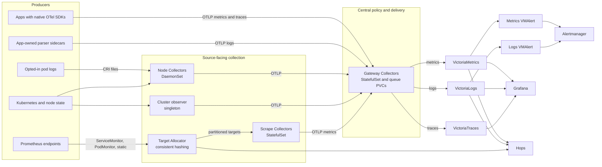

# Observability architecture

## Purpose

OpenTelemetry owns telemetry acquisition, enrichment, policy, and delivery. VictoriaMetrics,
VictoriaLogs, and VictoriaTraces store the three signals. Grafana, VMAlert, Alertmanager, and Hops
consume those backends. The [decision record][adr] defines the durable boundaries behind this
design.

## Topology

Every Collector role runs the upstream Kubernetes Collector distribution. Deployment mode and
configuration define the role.

## Signal ownership

### Metrics

Every pod receives platform metrics from the node and cluster Collectors. Application metrics use
the interface documented by that workload:

- Native OTel SDK metrics go directly to the Gateway over OTLP.
- Prometheus endpoints are discovered through ServiceMonitor or PodMonitor resources. The Target
  Allocator partitions targets among the two Scrape Collector replicas, which convert samples to
  OTLP before forwarding them to the Gateway.
- Static jobs cover cluster endpoints that do not have monitor resources.

One acquisition path owns each metric family. A workload may use both paths only when the families
are distinct, such as SDK request metrics and unique product metrics from a Prometheus endpoint.
Equivalent metrics must not enter through both paths.

Scrape health is represented by the `up` metric. Push health requires a stable emitted metric with
an absence alert, Kubernetes workload health, and Collector receiver/exporter health. Environment
variables configure an SDK that already exists; they do not create metrics in an uninstrumented
application.

### Logs

The node Collector reads CRI logs only for pods labeled `observability.home-ops/logs=true`. The
pod-level label includes every container. Platform Collectors perform CRI parsing, generic severity
handling, and Kubernetes enrichment.

Private file formats remain application-owned. A sidecar Collector may parse those files and export
normalized OTLP logs. The same stream must not also use node log collection because that would
create duplicate records.

### Traces

Applications with documented native OTel support send OTLP directly to the Gateway. They use
OTLP/HTTP on port 4318 or OTLP/gRPC on port 4317 according to the application's supported exporter.
They do not need a Collector sidecar. Owned code may use tested Operator auto-instrumentation.

Third-party language agents are enabled only after app-specific runtime and startup validation.
Agents execute inside the application process and can conflict with its runtime, libraries, security
context, startup hooks, or resource limits. No cluster-wide injection is used.

## Shared policy and identity

The Gateway adds `k8s.cluster.name`, derives missing namespace and instance identity, removes
sensitive HTTP attributes, controls metric cardinality, and routes each signal to its backend.
Signals use these attributes where applicable:

- `service.name` and `service.namespace`
- `service.instance.id`
- `k8s.cluster.name` and `k8s.namespace.name`
- workload, pod, container, and node identity

VictoriaLogs stream fields use service, namespace, and container identity. Grafana links logs to
traces through `trace_id`; trace-to-log queries use `service.name` and `k8s.namespace.name`.

## Delivery and storage

Node, cluster, scrape, application-sidecar, and Gateway Collectors use persistent sending queues.
Queues protect bounded backend outages; they are not telemetry retention or a message bus.

Gateway replicas use stable StatefulSet ordinals and one RWO queue PVC per replica. A restarted
replica reattaches its queue and resumes accepted batches. Collector replicas never share a bbolt
queue.

Backend ownership is fixed:

| Signal | Backend | Retention |
| --- | --- | --- |
| Metrics | VictoriaMetrics | 14 days |
| Logs | VictoriaLogs | Backend policy |
| Traces | VictoriaTraces | 7 days |

Metrics and logs have separate VMAlert instances. Both notify the shared Alertmanager. Grafana
queries all three backends and Alertmanager. Hops queries VictoriaMetrics, VictoriaLogs, VMAlert,
and the Target Allocator; trace investigation currently belongs in Grafana.

## Internal endpoints

| Purpose | Endpoint |
| --- | --- |
| OTLP/gRPC ingestion | `otel-gateway-collector.observability:4317` |
| OTLP/HTTP ingestion | `http://otel-gateway-collector.observability:4318` |
| Target Allocator API | `http://otel-scrape-targetallocator.observability` |
| VictoriaMetrics | `http://vmsingle-vm.observability:8428` |
| VictoriaLogs | `http://vl.observability:9428` |
| VictoriaTraces Tempo API | `http://vt.observability:10428/select/tempo` |
| Metrics VMAlert | `http://vmalert-vm.observability:8080` |
| Logs VMAlert | `http://vmalert-vl.observability:8080` |
| Alertmanager | `http://vmalertmanager-vm.observability:9093` |

[adr]: ../adr/0001-standardize-observability-on-opentelemetry.md
