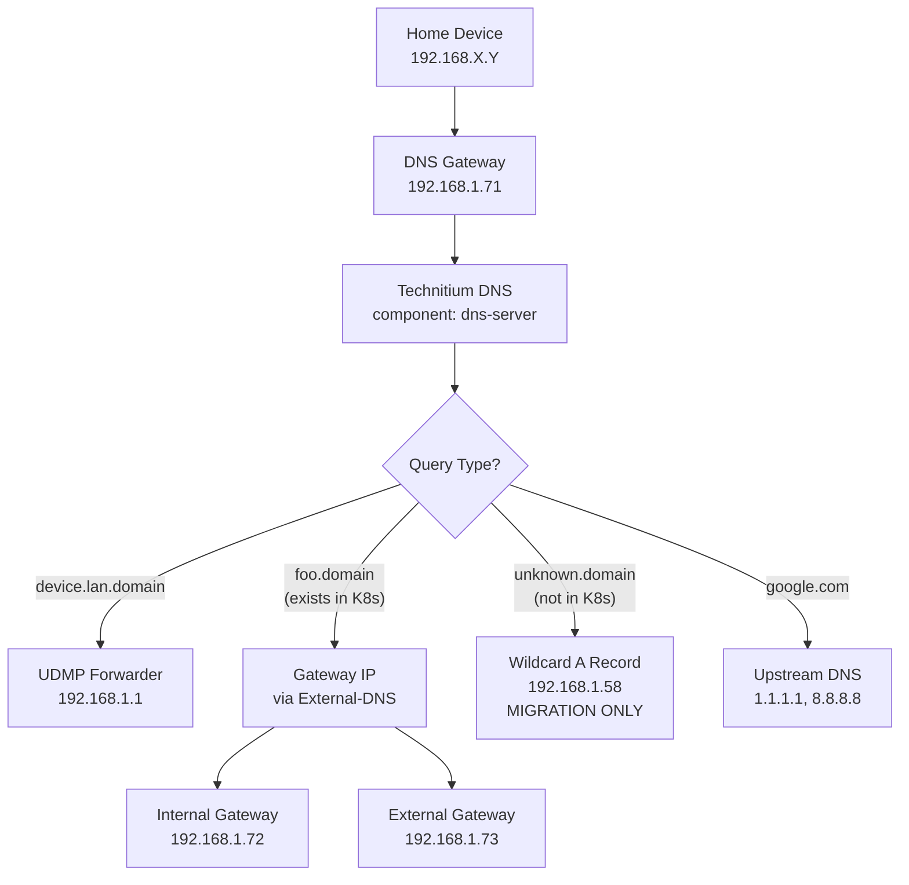

# DNS Architecture

## Overview

This document describes the DNS architecture and resolution flow for services running in the
cluster. For general cluster information and operational procedures, see the root CLAUDE.md file.

## DNS Resolution Flow



### Decision Logic

- **A) `device.lan.${SECRET_DOMAIN}`**: Conditional forwarder → `192.168.1.1` (UDMP)
- **B) `foo.${SECRET_DOMAIN}`** (exists in K8s): Zone lookup → Gateway IP via External-DNS
- **C) `unknown.${SECRET_DOMAIN}`** (not in K8s): Wildcard A record → `192.168.1.58` (migration fallback - temporary)
- **D) `google.com`**: Upstream forwarder → `1.1.1.1, 8.8.8.8`

## Core Components

### 1. Technitium DNS Server

Primary DNS server providing intelligent routing and conditional forwarding.

**Deployment**: `kubernetes/apps/dns-private/technitium-dns/`

- **Image**: `technitium/dns-server:13.6.0`
- **Port**: `5353` (target), exposed as `53`
- **Web UI**: `dns-test.${SECRET_DOMAIN}:5380`
- **Component Label**: `app.kubernetes.io/component: dns-server`
- **Storage**: PVC `technitium-dns-data` mounted at `/etc/dns`

**Zone Configuration**:

```txt
Zone: ${SECRET_DOMAIN}
├── *.${SECRET_DOMAIN} → 192.168.1.58 (wildcard fallback)
├── foo.${SECRET_DOMAIN} → 192.168.1.72 (specific record - overrides wildcard)
└── bar.${SECRET_DOMAIN} → 192.168.1.73 (specific record - overrides wildcard)

Conditional Forwarders:
lan.${SECRET_DOMAIN} → 192.168.1.1 (UDMP for local devices)

Upstream DNS:
Default: 1.1.1.1, 8.8.8.8
```

### 2. DNS Gateway Service

Provider-agnostic LoadBalancer service that separates infrastructure from application concerns.

**Configuration**: `kubernetes/apps/dns-private/dns-gateway/service.yaml`

- **Type**: LoadBalancer
- **VIP**: `192.168.1.71` (Cilium LBIPAM)
- **Traffic Policy**: Local
- **Selector**: `app.kubernetes.io/component: dns-server`
- **Ports**: TCP/UDP 53 → 5353

**Benefits**:

- Zero-downtime DNS provider switching
- Infrastructure/application separation
- Future Blocky/other DNS provider support

### 3. Envoy Gateway Infrastructure

**External Gateway** (`kubernetes/apps/network/envoy-gateway/external.yaml`):

- **VIP**: `192.168.1.73`
- **Target**: `external.${SECRET_DOMAIN}`
- **Purpose**: WAN/tunnel accessible services

**Internal Gateway** (`kubernetes/apps/network/envoy-gateway/internal.yaml`):

- **VIP**: `192.168.1.72`
- **Target**: `internal.${SECRET_DOMAIN}`
- **Purpose**: LAN-only services

**EnvoyProxy Configuration**:

- **Traffic Policy**: Cluster (via parametersRef)
- **TLS**: Wildcard certificate for `*.${SECRET_DOMAIN}`

### 4. External-DNS Architecture

Four-instance architecture for proper source separation and filtering:

#### Cloudflare External-DNS

**HTTPRoute Instance** (`kubernetes/apps/network/cloudflare-dns/httproute.yaml`):

- **Sources**: `gateway-httproute`
- **Filter**: `--gateway-name=external`
- **Purpose**: External HTTPRoutes → Cloudflare DNS
- **TxtOwnerId**: `cloudflare`

**CRD Instance** (`kubernetes/apps/network/cloudflare-dns/crd.yaml`):

- **Sources**: `crd`
- **Namespace**: `network`
- **Purpose**: Cloudflare DNSEndpoints → Cloudflare DNS
- **TxtOwnerId**: `cloudflare`

#### Technitium External-DNS

**HTTPRoute Instance** (`kubernetes/apps/dns-private/external-dns/httproute.yaml`):

- **Sources**: `gateway-httproute`
- **Purpose**: All HTTPRoutes → Technitium DNS
- **TxtOwnerId**: `technitium`

**CRD Instance** (`kubernetes/apps/dns-private/external-dns/crd.yaml`):

- **Sources**: `crd`
- **Namespace**: `dns-private`
- **Purpose**: Technitium DNSEndpoints → Technitium DNS
- **TxtOwnerId**: `technitium`

## Network Configuration

For Cilium and IP pool configuration, see `kubernetes/apps/kube-system/cilium/networks.yaml`.

## Target Inheritance Pattern

### Gateway Configuration

Gateways define target annotations that HTTPRoutes automatically inherit:

```yaml
# External Gateway
apiVersion: gateway.networking.k8s.io/v1
kind: Gateway
metadata:
  annotations:
    external-dns.alpha.kubernetes.io/target: external.${SECRET_DOMAIN}

# Internal Gateway
apiVersion: gateway.networking.k8s.io/v1
kind: Gateway
metadata:
  annotations:
    external-dns.alpha.kubernetes.io/target: internal.${SECRET_DOMAIN}
```

### HTTPRoute Inheritance

HTTPRoutes inherit targets from their parent Gateway without explicit configuration:

```yaml
apiVersion: gateway.networking.k8s.io/v1
kind: HTTPRoute
metadata:
  name: my-service
  # NO target annotation - inherits from Gateway
spec:
  parentRefs:
  - name: external  # Inherits external.${SECRET_DOMAIN}
  hostnames: ["service.${SECRET_DOMAIN}"]
```

## Service Migration Workflow

### Migration Process

1. **Deploy K8s service**: Create HTTPRoute with correct parentRefs
2. **Automatic DNS**: External-DNS detects HTTPRoute and creates records
3. **Target inheritance**: HTTPRoute inherits correct target from Gateway
4. **DNS resolution**: Specific record overrides wildcard fallback
5. **Traffic flows**: Home devices connect to appropriate gateway

### Post-Migration Cleanup

**Migration Support Infrastructure** (Temporary):
- Wildcard A record `*.${SECRET_DOMAIN} → 192.168.1.58` provides fallback for unmigrated Docker services
- Will be removed once all services complete Docker-to-Kubernetes migration

**Final Cleanup Steps**:
1. Remove wildcard A record: `*.${SECRET_DOMAIN} → .58`
2. Keep specific records created by external-dns
3. Clean unused Docker Compose configurations

## Traffic Flow Examples

### External Service Access

**Internal Client to External Service** (e.g., `home.${SECRET_DOMAIN}`):

```txt
MacBook → Technitium (.71) → Returns .73 → Direct connection to .73 → K8s external gateway
```

**External Client to External Service**:

```txt
Android → Cloudflare DNS → Returns Cloudflare IPs → Tunnel → .73 → K8s external gateway
```

### Internal Service Access

**Internal Client to Internal Service** (e.g., `dns-test.${SECRET_DOMAIN}`):

```txt
MacBook → Technitium (.71) → Returns .72 → Direct connection to .72 → K8s internal gateway
```

## DNS Record Distribution

### External HTTPRoutes

- `parentRefs: external` → Both Cloudflare DNS and Technitium DNS
- **Cloudflare**: CNAME to tunnel endpoint (internet access)
- **Technitium**: A record to `.73` (LAN access)

### Internal HTTPRoutes

- `parentRefs: internal` → Technitium DNS only
- **Technitium**: A record to `.72` (LAN access only)

### DNSEndpoints

- `dns-provider=cloudflare` → Cloudflare DNS (tunnel CNAME)
- `dns-provider=technitium` → Technitium DNS (Gateway A records)

## Operational Procedures

### Technitium Manual Setup

1. **Web UI Access**: `https://dns-test.${SECRET_DOMAIN}`
2. **Admin password change**
3. **TSIG key creation** (Settings → TSIG, HMAC-SHA256)
4. **Dynamic Updates enable** for `${SECRET_DOMAIN}` zone
5. **Security Policy configuration** (allow external-dns key)

### Zone Management via API

```bash
# Create primary zone
POST /api/zones/create?zone=${SECRET_DOMAIN}&type=Primary

# Add wildcard fallback
POST /api/zones/records/add?zone=${SECRET_DOMAIN}&type=A&name=*&rdata=192.168.1.58

# Conditional forwarder for local devices
POST /api/zones/create?zone=lan.${SECRET_DOMAIN}&type=Forwarder&forwarder=192.168.1.1
```

## Key DNS Principles

### External-DNS Configuration

- **Target annotations**: Only on Gateways, never on HTTPRoutes
- **Source configuration**: Use `gateway-httproute` exclusively
- **Inheritance pattern**: HTTPRoutes automatically inherit Gateway targets
- **CNAME enforcement**: Prevents A record fallbacks to LoadBalancer IPs

### Component-Based Architecture

- **Provider abstraction**: Use `app.kubernetes.io/component: dns-server` for service selection
- **Zero-downtime migrations**: Enable seamless DNS provider switching
- **Infrastructure separation**: Decouple dns-gateway service from dns-server applications

## High Availability and Clustering

### Current Limitations

- **Single Technitium replica**: No native clustering support
- **File-based zone data**: No database backend for core DNS data
- **Database support**: Query logging only (not zone data)

### Future Enhancements

- **Multiple DNS providers**: Deploy Blocky alongside Technitium
- **Provider failover**: Use multiple `dns-server` component labels
- **Load balancing**: DNS gateway routes to available providers

## Security and Access Control

### DNS Server Security

- **TSIG authentication**: Required for dynamic updates
- **Security policies**: External-DNS key permissions
- **Network isolation**: DNS-private namespace separation

### Gateway Security

- **TLS termination**: Wildcard certificates
- **Traffic policies**: Cluster-wide load balancing
- **Namespace isolation**: Controlled cross-namespace access

## Monitoring and Observability

### Service Monitoring

- **ServiceMonitor**: Enabled for all external-dns instances
- **Metrics**: DNS query performance and success rates
- **Health checks**: Liveness/readiness probes for Technitium

### Troubleshooting

- **DNS resolution testing**: `dig @192.168.1.71 service.${SECRET_DOMAIN}`
- **External-DNS logs**: Check record creation/deletion
- **Gateway connectivity**: Verify LoadBalancer service status

## Architecture Benefits

- **Migration-Friendly**: Gradual service migration with automatic DNS updates
- **Zero-Downtime Capable**: Infrastructure changes without service interruption
- **Provider Agnostic**: Easy switching between DNS server implementations
- **Tunnel Compatible**: Proper CNAME chains for Cloudflare tunnel architecture
- **Intelligent Fallback**: Native wildcard → specific record override behavior
- **High Performance**: Multi-instance external-dns with source-specific optimization
- **Secure**: TSIG authentication and namespace isolation
